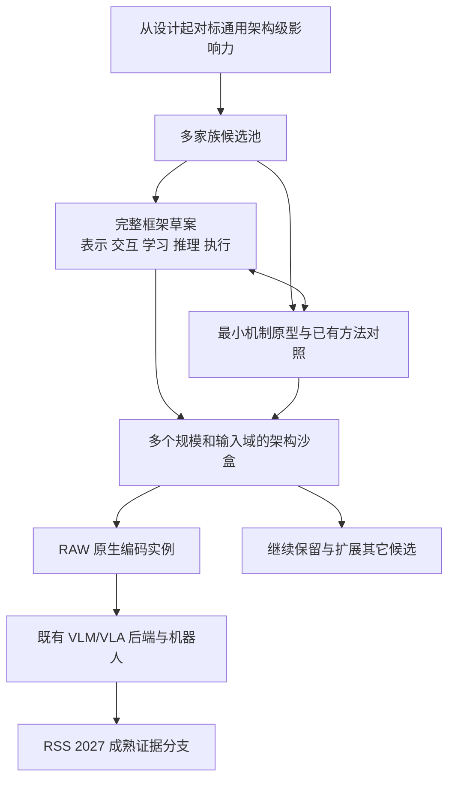

# OWAC 研究路线与 RSS 2027 投稿计划

**版本：v4，2026 年 10 月 8 日。项目从设计起就以“具备 ResNet／Transformer 级影响力潜力的新网络架构或实现框架”为目标，围绕整体计算方式展开原创研究。** 这一目标落实到表示、交互、组合、学习、推理、规模扩展、计算实现和复用接口，作为当前设计标准，而不只写成远期愿景。实际影响力由研究结果与后续应用检验。

RAW 原生编码和机器人闭环是第一个完整实例。主方法不做 RAW→RGB/sRGB/XYZ 转换，不依赖原 RGB 图像塔完成主要编码；新框架输出可供现有 VLM/VLA 后端消费的特征、token 或其他表征。神经、生物启发神经、解析、显式推断及混合实现都可探索，神经科学和生物学可以启发其中任何一种。

本版采用广泛保留、分层投入的研究方式：首批设立 **12 个候选框架家族**，后续允许增加、拆分或合并；取消 P1 的默认主线地位。完整框架草案与最小机制实验从第一天并行，逐步增加实现和训练成本。RSS 2027 是阶段性验证与发表节点，论文选择成熟证据，整个研究计划持续维护多方向探索。

资源条件：机械臂、轮式人形机器人、充足 GPU、约十人团队，相机待定。以下是设计决议、候选空间和研究计划；目前尚无已验证的 OWAC 新架构或实验结果。项目继续使用 OWAC 名称，论文题目待具体框架与证据形成后确定。

## 1. 最高层设计目标与完整框架契约

项目要回答的问题是：

> 能否提出一种新的、可持续扩展的计算组织方式，使其既能形成完整的 RAW 编码系统，也能够迁移为其它信号与任务的基础架构？

研究单位可以是一个新原语及其架构家族，也可以是新的状态组织、学习—推理机制或执行框架。新颖性不限定为改动某一个 block；需要说清哪些规则共同形成了框架、它们为何有效，以及如何被其他研究者复用。

### 从立项起生效的设计决议

- **以通用架构潜力决定问题和设计。** 可组合性、可扩展性和迁移能力从第一版草案就纳入考虑，不等 RAW 上涨点后才追加。
- **完整框架与最小实验并行。** 一开始就画出端到端架构与执行过程，用低成本原型检验其中最关键的假设；实现成熟度可以分阶段增加。
- **保留机制多样性。** 候选覆盖计算单元、交互方式、表征对象、时间与记忆、约束求解、几何结构和执行运行时；不将同一注意力变体的十种配置视为十条路线。
- **RAW 是首个深度验证场景。** 其测量噪声、动态范围、空间结构和闭环动作需求用于发现问题；核心框架不必永久绑定 Bayer 排列或某个 VLA。
- **投稿分支与项目候选池分别管理。** 为 RSS 冻结的是可报告的实现、证据和协议，整个架构探索保持开放。

### 每个候选的完整框架设计契约

以下内容需要在研究卡中明确；不要求第一轮就完成所有功能的实现。

| 设计层面 | 每个候选应回答什么 |
| --- | --- |
| 状态与表示 | 计算对象是向量、场、图、分布、系数、事件还是可塑记忆？位置、时间、有效性如何表示？哪些状态长期保留？ |
| 交互与拓扑 | 信息如何组合、竞争、绑定或传播？局部到全局如何形成？主要计算发生在哪里？ |
| 组合与扩展 | 怎样增加宽度、深度、分辨率、输入长度、时间跨度和模块数？如何形成小、中、大参考架构？ |
| 学习与推理 | 哪些量学习，哪些解析确定？训练如何优化？部署时如何维护/清空状态，如何控制迭代与计算预算？ |
| 数值与硬件实现 | 复杂度、实际时延、内存、访存和并行性如何变化？支持缓存、稀疏或增量更新吗？ |
| 通用输入与读出 | 哪部分是 RAW 适配，哪部分是核心框架？迁移到其它信号时允许改哪些接口，哪些规则必须保留？ |
| 复用与工程接口 | 最小算子/求解器 API、标准组合单元、参考模型、训练或求解配方及可复现评测如何提供？ |

规模实验记录实际学习曲线，不预先假定存在有利的 scaling law。框架可以复用已有优化器、矩阵运算、残差或 attention 子模块；贡献在于被明确界定的新组织方式及其作用。

研究证据分为四层，并行规划、逐步加深：

| 层级 | 交付 |
| --- | --- |
| 机制 | 最小方程或算法、最近方法对照、可证伪问题 |
| 架构 | 完整组合、学习/推理流程、多个规模与不同输入结构 |
| 实现 | 可运行参考系统、成本分析、可复现接口与训练配方 |
| 机器人 | RAW 到既有 VLM/VLA 后端的完整实例和真实闭环证据 |



### 保留的项目边界

| 项目 | 约束 |
| --- | --- |
| RAW→RGB / sRGB / XYZ | 主方法不生成此类中间图像作为下游输入，不以先去马赛克再改名替代 RAW 原生处理 |
| 校准 | 允许黑电平、响应、增益、坏点掩码、CFA 重排及噪声建模，逐项披露 |
| 既有模型 | 移除原 RGB 图像塔，继承语言与动作后端，说明其预训练来源 |
| 教师与重建 | 主方法不采用 RGB 教师蒸馏或 RGB 重建；允许 RAW 域预测 |
| 外部 RGB | 允许作为独立强基线、人工预览和标注，不流入主编码链路 |
| 内部表示 | 不强迫所有候选采用 token、固定层数或相同状态形状 |
| 实现选择 | 神经、非神经及混合实现均可；准确说明学习参数和计算边界 |
| 生物启发 | 可以指导网络结构、信号处理、学习或运行时，区分生物证据与工程抽象 |

## 2. 文献定位：什么已经有人做，什么需要我们证明

“使用 RAW”“跳过固定 ISP”“使用相机元数据”“将 RAW 转为 token”均不能单独支撑首创。需要围绕新的整体计算框架、核心机制及其闭环效果建立贡献。

| 一手工作 | 对本项目的直接意义 |
| --- | --- |
| [ISP-less Low-Power Computer Vision，2022](https://arxiv.org/abs/2210.05451) | 不经过常规 ISP 的 RAW 视觉已有研究，不能将旁路 ISP 本身作为贡献 |
| [RAW-Adapter，ECCV 2024](https://arxiv.org/abs/2408.14802) | 输入级可学习 ISP 与模型级适配已有先例；本版应超出前置 adapter |
| [AODRaw，CVPR 2025](https://openaccess.thecvf.com/content/CVPR2025/html/Li_Towards_RAW_Object_Detection_in_Diverse_Conditions_CVPR_2025_paper.html) | 真实 RAW 检测与 RGB 教师辅助预训练已有基础；本版不沿用教师蒸馏作为核心 |
| [Raw-VLM 作者仓库](https://github.com/kepengxu/PRISM-VL)、[PRISM-VL，2026](https://arxiv.org/abs/2605.11727) | 已研究 RAW 相关表征、tokenization、相机条件化与视觉语言理解；不能声称首次 RAW 接入 VLM |
| [RawVLA，2026](https://arxiv.org/abs/2609.37530) | 动作监督的流式神经 ISP、冻结 VLA 以及真实机器人实验构成首要直接基线 |
| [RAWild 作者仓库](https://github.com/I2WM/RAWild) | 跨传感器 RAW 感知已有工作；泛化必须用真实留出相机验证 |

RawVLA 的神经 ISP 仍输出供 VLA 使用的图像，而本版 OWAC 直接输出非图像表征并替换原图像塔。这是明确的方法边界，但不等于已证明新颖性或优势。RawVLA 的实机已经使用 12-bit Bayer 相机，且其方法输入包含去马赛克后的线性测量；因此“真实 RAW 实机”不是 OWAC 的首创，复用数据前也要检查是否仍保有原始 CFA。其神经 ISP 输出不应被人为限制为 uint8。[RawVLA 原文](https://arxiv.org/html/2609.37530v1)

本轮检索支持继续研究下列组合，但不构成“首次”的证明：

1. 在原始 CFA 采样上，设计与噪声、空间尺度和动作定位需求共同相关的编码机制。
2. 使这种表征接入既有语言—动作后端，并验证替换图像塔后的能力恢复路径。
3. 在强成像基线、普通 RAW 网络和简单测量投影对照下，解释闭环收益来自哪里。
4. 若非神经网络路线成立，明确其计算、样本效率和失效边界，而非仅强调没有反向传播。

### 生物视觉与数学工具能提供的启发

| 基础工作 | 可以借鉴的原则 | 不能直接推导的结论 |
| --- | --- | --- |
| [Atick 与 Redlich，1992](https://redwood.berkeley.edu/wp-content/uploads/2018/08/Atick-Redlich-NC92.pdf) | 编码应在冗余压缩与噪声抑制之间权衡，滤波策略与信噪比相关 | 中心—周边滤波一定优于学习模型，或暗光下应无限放大高频 |
| [Olshausen 与 Field，1997](https://www.rctn.org/bruno/papers/VR.pdf) | 稀疏表示可形成局部、方向性结构编码 | 稀疏系数天然具备语言语义，或最优化求解一定适合实时控制 |
| [Mallat，Group Invariant Scattering](https://arxiv.org/abs/1101.2286) | 固定多尺度小波与非线性算子能构造具有特定稳定性的描述符 | 全局平移不变性适合机器人定位，或稳定性理论直接保证操作成功 |
| [Mäkitalo 与 Foi，2013](https://researchportal.tuni.fi/en/publications/optimal-inversion-of-the-generalized-anscombe-transformation-for-/) | Poisson–Gaussian 噪声需要显式处理，方差稳定化有适用条件 | 一次 log 或 Anscombe 变换就能消除低光噪声 |

这些是两类实现共同的设计依据，不是 OWAC 的实验证据，也不限于解析前端。生物机制可以约束可训练网络的连接、状态、非线性和动态更新；不必将神经网络简单等同于现有 CNN 或 Transformer。脉冲神经网络仍是神经网络；“生物启发”也不等于已经证明生物系统采用相同算法。

### 架构与计算机制层面必须补齐的相关工作

| 原始研究 | 已有计算思想 | OWAC 必须越过的边界 |
| --- | --- | --- |
| [Deep Residual Learning，2015/2016](https://arxiv.org/abs/1512.03385) | 残差参数化和深层网络训练 | 参照其可复用规则，不把堆叠模块数当原创性 |
| [Attention Is All You Need，2017](https://arxiv.org/abs/1706.03762) | 以 attention 构建序列变换架构 | Transformer 不是 attention 思想的起点；比较具体计算机制 |
| [Rao 与 Ballard，1999](https://doi.org/10.1038/4580) | 高层预测、低层预测误差与循环推断 | “预测—误差—反馈”本身已有先例 |
| [Sacramento 等，2018](https://arxiv.org/abs/1810.11393) | 多隔室树突电路与局部误差驱动学习 | 给单元增加树突分支或局部误差，不自动形成新原语 |
| [Chavlis 与 Poirazi，2025](https://www.nature.com/articles/s41467-025-56297-9) | 受树突启发的结构化连接与受限输入采样 | 已有可训练的树突 ANN，不能声称首次以神经科学设计网络 |
| [Hénaff 等，2020](https://pubmed.ncbi.nlm.nih.gov/32427825/) | 用群体活动的不同统计量表征特征与不确定性 | 内容与可靠性共同编码已有实验和模型基础 |
| [Slot Attention，2020](https://arxiv.org/abs/2006.15055) | 多轮竞争分配与对象表征 | 竞争、迭代、多个槽位均不能单独作为区别 |
| [Sinkformers，2021/2022](https://arxiv.org/abs/2110.11773) | 用双随机归一化改变 attention 的交互 | 仅把 softmax 换为 Sinkhorn 或增加容量约束不是新思想 |
| [Belief Propagation Neural Networks，2020](https://arxiv.org/abs/2007.00295) | 可学习的消息传递，继承 BP 的部分结构与性质 | 避免重复计算证据已有工作，必须与 BP/BPNN 直接比较 |
| [Growing Neural Cellular Automata，2020](https://distill.pub/2020/growing-ca/) | 可微局部更新产生自组织动态 | 局部规则、迭代和仿生自组织已有模型 |
| [Mamba，2023](https://arxiv.org/abs/2312.00752) | 输入相关的状态空间更新 | 可选择的状态记忆和线性序列计算已有强基线 |
| [Muzellec 等，2025](https://arxiv.org/abs/2502.21077) | 复值表示与 Kuramoto 同步用于视觉分组 | 相位同步和振荡绑定也不能直接视为新颖点 |

检索结论是：这些机制有值得探索的计算含义，同时已有密集先例。当前尚未证明某个 OWAC 候选具有首创性。每个候选需交付“最近工作的规则与框架—本候选的新增设计—可检验差异”三栏对照，不能以没有检索到同名方法代替新颖性分析。

## 3. RAW 优势的物理表述

建议将动机写成：“常规成像处理可能弱化机器人所需的测量证据；直接利用传感器观测有望改善部分低照度和高反差任务。”需要区分以下概念：

- 10、12、14 bit 是采样或编码精度。有效动态范围由饱和上限、噪声底和采集模式共同决定，不能仅由文件位深判断。EMVA 1288 用饱和与最低可检测信号定义动态范围。[EMVA 官方资料](https://www.emva.org/standards-technology/emva-1288/emva-standard-1288-downloads-2/)

- RGB 不必是 8 bit；线性 RGB、浮点 RGB 和显示用 sRGB 是不同接口。Bayer RAW 也不是每个像素均有完整三色测量。

- ISP 中的裁剪、降噪、局部色调映射与量化可能丢失任务线索；合理的去马赛克、校准和降噪也可能帮助模型。不能预设去掉全部 ISP 一定更好。

- 少光子导致的低信噪比、传感器已饱和的区域，不能仅靠 RAW 输入恢复。长曝光、多帧融合或主动照明带来额外信息，必须作为独立实验变量。

- RAW 是接近传感器的数字读数，通常已包含传感器内部处理，不能简单等同于未经任何处理的物理光子计数。

Tesla 可作为工程动机参考，原始材料入口是 [Tesla AI Day 2021 官方视频](https://www.youtube.com/watch?v=j0z4FweCy4M)。本次可访问的一手页面不足以核实“完全绕过哪些 ISP 环节、在何版 HydraNet 上得到多少收益”的具体说法；首稿不使用未经核实的工程细节或定量提升作为论据。

## 4. 架构研究的假设与验收标准

**H1：新的计算组织方式具有可辨认的机制价值。** 在相同信息和合理预算下，比较最接近的已有规则，说明哪些状态、交互或执行选择导致了差异。有效的组合与系统结构也可以构成架构贡献，需要明确其中的新增设计。

**H2：这种机制能够形成可组合、可扩展的架构家族。** 从初版就设计小、中、大配置和不同输入域，检查组合后的训练/求解稳定性、性能—成本关系和适用边界。多个规模档位用于观察趋势，不足以单独宣称普适的尺度规律。

**H3：同一框架能够支持 RAW 编码及语言条件控制。** 保留任务信息、完成与既有后端的适配，并在真实闭环、跨照明、跨相机、样本效率或系统成本中展现有意义的价值。

**H4：关键规则可以在第二种信号结构上复用。** 例如从 RAW 空间采样迁移到不规则测量集合或一维异方差时序；只替换已声明的输入/输出接口。早期使用可控信号，后续根据候选性质选择真实的音频、触觉或其它数据，不要求所有候选都适合所有模态。

评价对象是完整框架潜力与当前证据，而不是只看一次 RAW 成功率。每个候选应明确：状态、规则、组合方式、学习/求解过程、扩展路径、最近已有方法、成本和能够否定它的实验。

使用多维证据记录：机制差异、架构可组合性、规模趋势、数据需求、迁移能力、真实任务收益、完整系统成本、实现成熟度和未解决问题。**不以单一加权总分决定存废。** 不同候选可以分别在效率、几何泛化、动态适应或信息保留上形成优势。

可表示性、代数等价性、架构组织和实际效率是不同问题。若局部公式等价于已知运算，进一步检查整体组织或执行机制是否仍有实质贡献；若整套方法均是已有设计的直接复现，则作为基线或研究素材管理，不以改名声称原创。

## 5. 十二个候选框架家族与并行探索

### 5.1 候选池与多样性

首批保留以下十二个家族，**不预设唯一主线**。每一项都是从已有研究出发、仍需发现具体新规则的研究方向；家族名称本身不构成成果。它们覆盖证据组合、动态求解、时间与记忆、测量几何、信息变换和执行方式等不同计算思想。

| ID / 家族 | 整体框架要探索的改变 | 第一项可控验证 | 一手起点与需要越过的边界 |
| --- | --- | --- | --- |
| F01 隔室式证据计算 | 在多层/多步计算中分隔测量、可靠性与上下文状态，研究交互及共同读出规则；扩展为多源信号计算单元 | 矛盾线索、相关测量及弱目标定位 | [树突 ANN](https://www.nature.com/articles/s41467-025-56297-9)、[BPNN](https://arxiv.org/abs/2007.00295)；双分支、门控和证据去重均已有先例 |
| F02 预测与修正执行 | 表征通过预测、残差与修正形成，未解释信号决定后续计算位置、强度和停止；形成按证据分配计算的执行器 | 局部难度变化、曝光突变与计算预算变化 | [Rao–Ballard](https://doi.org/10.1038/4580)；预测编码及循环 refinement 本身不是新思想 |
| F03 约束与平衡态表征 | 输出由测量、结构及任务约束共同定义的稳定状态决定；设计状态方程、求解过程与跨层组合 | 缺失、饱和及冲突测量下的恢复与最坏求解时延 | [Deep Equilibrium Models](https://arxiv.org/abs/1909.01377)；需要超出为固定点模型替换输入，允许解析求解版本 |
| F04 相位与同步关系计算 | 以幅度/内容和动态关系状态分别组织证据及绑定，形成关系计算框架 | 相交轮廓、多目标分组和重复纹理 | [复值与 Kuramoto 动态](https://arxiv.org/abs/2502.21077)；振荡与同步已有模型，生物绑定假说不视为定论 |
| F05 可编程局部场 | 用共享局部规则构建自组织、可迭代或异步的计算场，研究传播、边界、持久状态及读出 | 局部损坏、缺失与分辨率变化下的结构恢复 | [Neural Cellular Automata](https://distill.pub/2020/growing-ca/)；需说明与循环 CNN/GNN 的实质差异 |
| F06 变化触发的运行时 | 以证据变化触发计算与通信，未触发区域维护状态；将阈值、缓存和调度视为整体框架 | 暗噪声中的微小运动、曝光变化、漏检与实际访存/时延 | [Delta Networks](https://proceedings.mlr.press/v70/neil17a.html)；差分阈值与事件式计算已有，帧 RAW 不因此变为事件相机 |
| F07 多时间尺度连续状态 | 用连续状态组织积分、遗忘与空间交换，显式处理观测间隔及时间尺度 | 不规则采样、快速运动和缓慢照明漂移 | [Liquid Time-constant Networks](https://arxiv.org/abs/2006.04439)、[Mamba](https://arxiv.org/abs/2312.00752)；需提出不同的动力学/组织规则 |
| F08 快慢可塑记忆 | 长期参数学习运行中状态/连接的写入、巩固与擦除，形成可持续适应的记忆框架 | 遮挡后重现、光照漂移、记忆容量与干扰 | [Fast Weights](https://arxiv.org/abs/1610.06258)、[线性 attention 与快速权重](https://proceedings.mlr.press/v139/schlag21a.html)；新规则需越过已知等价形式 |
| F09 测量几何驱动 | 将输入视为带采样算子与坐标的测量集合，按明确的变换法则组织计算；核心不绑定固定图像网格 | 方向、采样密度及 CFA 改变，区分真实对称变换与域变化 | [Gauge Equivariant CNNs](https://arxiv.org/abs/1902.04615)；换 CFA 并不自动构成可保持信息的群变换 |
| F10 一致性组合与路由 | 局部几何假设通过一致性形成动态实体，研究分裂、合并、竞争及反向解释 | 部分遮挡、相同局部纹理而不同整体结构 | [Capsule Routing](https://arxiv.org/abs/1710.09829)、[Slot Attention](https://arxiv.org/abs/2006.15055)；一致性路由、槽位竞争已有 |
| F11 解析多尺度与统计表征 | 以具有明确性质的变换、统计量和显式求解组织信号，研究信息、噪声与定位精度的可控取舍 | 微弱边缘与精确位置，对比固定小波、投影及学习方法 | [Scattering](https://arxiv.org/abs/1101.2286)；已有稳定性结论不能自动迁移到新设计，适合严格非神经实现 |
| F12 可逆状态与延迟压缩 | 内部尽量保留可回访信息，将不可逆选择延后到任务读取，统一组织主状态、细节存储和释放规则 | 事后指定的微弱细节检索，在相同总存储与传输预算下比较 | [i-RevNet](https://arxiv.org/abs/1802.07088)；可逆主干已有，可逆不等于去噪或压缩后无损 |

### 5.2 将家族发展为真正的框架候选

每个家族先产出一张框架研究卡，至少包含：

1. 要解决的基础计算问题及当前方法的具体失效。
2. 启发来源和最近工作，明确相同部分与尚待提出的设计。
3. 最小状态与方程/算法，以及端到端框架草图。
4. 学习或求解方式、组合单元、扩展到多个规模的方案。
5. RAW 输入和现有 VLM/VLA 的连接方式，以及一个第二信号实例。
6. 支持实验、反例、信息/计算预算和下一项待获取的证据。
7. 当前实现成熟度、负责人、版本及下一次评审日期。

研究卡可以记录“尚未解决”的部分，后续由原型补齐。第一轮重点让各家族获得相称的探索机会，不将已写得更详细的 F01 自动视为更有价值。

以下重叠需要通过公式和执行过程检查：

- F02 与 F03 可能同为能量下降，但可以分别研究计算分配与解的约束；若完全相同就合并。
- F06、F07、F08 分别关注何时执行、状态演化和记忆写入，也可能存在等价形式。比较时参考 [SSM–attention duality](https://arxiv.org/abs/2405.21060)。
- F04 与 F10 都可能做绑定，需区分连续关系状态与显式实体组合。
- F05 与循环 CNN/GNN 需比较更新拓扑、执行和状态保持，避免仅改术语。
- F11 与 F12 可以共享变换工具，独立性取决于统计性质与信息组织是否提出不同问题。

家族之间可以交叉组合，但先记录各自贡献，再验证交互；不按所有模块的笛卡尔积进行无目的架构搜索。探索的广度按不同计算假设计，不按名称或超参数配置数计。

### 5.3 一个具体研究卡示例：F01

以下仅作为如何写清问题的示例，不决定其它候选的内部表示，也不授予资源优先级：

```text
S_i = (v_i, u_i, c_i, p_i)
v_i: 测量形成的局部内容
u_i: 测量噪声与有效性摘要
c_i: 上下文或解释状态
p_i: 测量支持范围、来源与相关性摘要
```

该框架尝试通过明确的隔室交互形成表征，同时区分新观测与重复使用的旧证据。神经版本学习局部变换与交互，解析版本可使用显式统计规则。完整设计还需定义层间/时间上的组合、状态压缩、梯度或求解过程、输出接口，以及小中大配置。

核心交互仍待推导。按逆方差加权和 BP 的消息更新已有标准形式，因此具体候选必须说明新的组合/状态/执行规则在哪里；不能仅以增加状态字段作为贡献。物理测量噪声与任务不确定性应分别定义，任意 score 不自动具有概率含义。

其它研究卡可以采用复数状态、连续场、动态实体、可写连接、隐式解或解析系数，不需要转换为 F01 的四元状态。

### 5.4 共享外部接口，保留内部自由

共同基础设施负责数据、版本、评测和后端接入，不规定候选内部必须像 Transformer。建议采用最小外部约定：

```text
observations + metadata + optional_state + compute_budget
    → representation + optional_state + validity + cost_record
```

representation 可以是特征场、集合、图、系数或 token；接入现有 VLA 时使用明确的读出接口。比较完整 RAW—VLA 系统时，报告读出成本和后端输入预算；机制与架构实验保留各自自然形式，不强制相同内部 token 数。

RAW 场景共同检查实际 CFA 位置/类型、低频与颜色相关测量、空间定位、坏点/饱和、数值精度和有效性。任何候选均不通过中间 RGB 图像绕回原图像塔。

学习版本可使用 RAW 自监督、RAW—语言对齐和动作学习；解析或显式推断版本说明拟合与求解过程。允许标准反向传播，也允许将新的学习机制作为某个方向的研究对象，不要求所有家族同时创新训练算法。

### 5.5 从第一天设计规模与执行路径

每张卡同时保留两个视图：能解释核心机制的最小原型，以及支持该框架扩展的完整结构。用原型发现的问题修订整体设计，用整体设计识别原型可能隐藏的瓶颈。

早期检查多个输入长度/分辨率、状态大小或迭代预算；完整沙盒阶段增加小中大模型和数据量变化。对求解器、稀疏执行或状态框架，扩展轴可以不是网络深度。

计算报告同时包含算法成本、当前参考实现的实际吞吐和主要瓶颈。若异步、增量或局部执行本身就是候选核心，应在最小原型中直接验证；不会统一推迟到前馈模型有效之后。未优化实现可以保留研究机会，部署主张仍需可测量的完整成本。

## 6. F11 的解析起点与共享诊断工具

以下 B1/B2 沿用 v2 的可执行设计，作为 F11 的探索素材、共享机制探针和解析对照。它们本身由已有工具组成，当前不被列为已成立的框架级原创成果，也不比生物启发的神经实现具有更高优先级。

### B1：固定的解析测量编码

这一分支使用固定滤波、显式统计估计和确定性规则。所有传感器到描述符的运算均可写出，不训练卷积、attention 或神经 MLP。

**步骤一：保留真实测量与噪声模型。**

对采样位置 i、滤色片类别 c，记录原始读数 y、黑电平 b、白电平 w，采用固定校准尺度：

```text
r_i = (y_i - b_c) / (w_c - b_c)
Var(r_i | μ_i, gain, exposure) ≈ α_c · μ_i + β_c
```

α、β 应由对应增益/曝光设置的实测数据拟合；μ 是未知无噪均值，其局部估计只是近似。读出相关噪声明显时，使用相应协方差模型，不能默认所有采样独立。保留黑电平附近的有符号残差；对饱和、坏点及缺失值单独标记，不将饱和信号当作高置信度观测。

**步骤二：中心—周边与方向结构分析。**

在同类 CFA 采样点及其实际坐标上构造局部核，计算多尺度低通、中心—周边差分与方向性响应。首先分别分析各 CFA 子格；跨类型组合使用经过校准的区域描述符，不插值出缺失的逐像素 RGB 值。

对线性滤波核 a：

```text
d = aᵀr
σ_d² = aᵀΣa
z = d / sqrt(σ_d² + ε)
ON = max(z, 0), OFF = max(-z, 0)
```

z 是噪声归一化响应，不是恢复后的图像，也不是经证明的任务置信度。ε、增益上限和噪声模型需要标定/验证，避免暗区数值放大。尺度选择可依据可预测的输出噪声和局部结构采用确定性规则，并与固定尺度对照。

保留有符号方向响应或复小波的相位信息，使精细位置能够被下游辨认；不能仅输出丢失位置与符号的全局散射能量。CFA 色彩通道与生物视锥并不等价，不能直接照搬生理参数。

**步骤三：并行保留低频与绝对测量。**

仅保留对比度会丢掉亮度、缓变表面和部分颜色线索。因此，每个区域还输出按 CFA 类型统计的低频/DC、曝光/增益、饱和比例和噪声摘要。它们是测量描述符，不是三通道成像结果。对“红色杯子”等任务，必须专门检验这些统计是否足以支持颜色与语言条件，而不能只做灰度几何任务。

**步骤四：确定性打包为空间描述符。**

每个 token 包括：

```text
t_j = [
  多尺度有符号响应与方向/相位特征,
  分 CFA 的低频测量,
  噪声/饱和/有效性描述,
  位置、尺度、相机与时间信息
]
```

先固定规则网格输出，再尝试“均匀覆盖 + 有限自适应细节配额”。若做噪声阈值收缩，保留一条低维、未阈值化的测量摘要，检查微弱任务线索是否被删掉。不能把“弱信号”自动等同于“无用信息”。

这些 token 不一定包含物体类别，也不保证是动作的充分统计量；后端需要学习如何从它们推理和控制。所有压缩都会有损失，应该测量具体保留和舍弃了什么。

### B2：可选的显式稀疏推断

B1/B2 可独立进入 F11 的候选池，按研究卡和实现成本安排并行或分批验证。B2 探索以固定解析字典表示 RAW patch：

```text
c* = argmin_c (r - Φc)ᵀΣ⁻¹(r - Φc) + λ ||c||₁
```

Φ 的原子定义在实际 CFA 测量空间，不以 RGB 重建为优化目标。输出稀疏系数、空间索引和残差统计。使用显式最优化求解；若改为可训练展开网络，就应归到路线 A。

固定字典与数据驱动字典需分开报告；后者可以是传统统计学习，但不能声称完全不学习。逐 patch 迭代求解可能比小网络慢，B1/B2 在 F11 内按准确率、求解代价和架构扩展潜力比较，允许小规模并行探索。

### 非神经网络边界的验收

| 实现 | 如何表述 |
| --- | --- |
| 固定滤波、解析归一化、显式最优化、确定性打包 | 非神经 RAW 编码器 |
| 数据统计得到的 PCA、白化或字典 | 统计学习编码器，说明拟合数据与方法 |
| 固定维度映射、补零或固定线性嵌入 | 可以保留严格非神经编码边界 |
| 可训练线性投影 | 明确披露学习参数；最严格版本采用固定映射作对照 |
| 神经 MLP、可训练跨注意力 resampler | 神经适配模块，计入模型与算力；不能藏在“接口”名称下 |
| SNN、可训练滤波器、可训练迭代展开 | 神经网络路线 |
| 原有 VLM/VLA 的语言和动作模型 | 允许保留，但整套系统仍包含神经网络 |

首个严格版本采用固定描述符、固定嵌入映射，训练后端去适应这种输入。另设学习投影版本衡量接口训练的重要性。不能把大部分 RAW 视觉处理搬到一个庞大的“connector”中，然后宣称非神经编码器完成了全部工作。

## 7. 与现有 VLM/VLA 的接口及语义恢复

建议选团队最熟悉的 [openpi 检查点](https://github.com/Physical-Intelligence/openpi) 作为主后端，以 [OpenVLA-OFT](https://openvla-oft.github.io/) 作为第二后端验证。锁定代码版本、权重和预训练来源，不从零训练完整 VLA。

openpi 的公开实现中，`embed_prefix` 将图像塔输出与语言 token 组成前缀，因此存在替换视觉入口的工程位置；训练和推理入口还会执行观测预处理，必须一并改成 RAW/特征路径。只换图像塔、继续走 RGB 图像处理器是不完整的实现。[openpi 的 pi0.py](https://github.com/Physical-Intelligence/openpi/blob/main/src/openpi/models/pi0.py)

接入既有 VLA 的读出接口至少包含下列信息；这是后端适配约定，不限定十二类候选内部均采用 token：

```text
features:    [batch, n_tokens, descriptor_dim]
positions:   每个 token 的实际图像坐标与支持尺度
camera_time: 相机标识、时间戳或时间差
validity:    token 与底层观测的有效性掩码
uncertainty: 明确定义的测量噪声/饱和摘要
```

接口层负责维度、序列顺序、位置编码和 attention mask。可靠性信息如何进入后端必须实现为可消费的字段或特征；不能仅把它保存在日志里。原有序列位置编码不自动等价于二维几何位置，多视角和时序索引也不能混淆。

最大的代价是：**移除原图像塔，也移除了它的大量视觉语义预训练能力。** 继承语言模型和动作头不会自动补回这一缺口。不能预计仅凭 100—200 条动作示范就恢复开放词汇视觉理解。

建议分三阶段诊断：

1. **表征是否保留信息。** 用简单探针评估位置、边缘偏移、颜色/材质区分、语言目标选择；探针结果是诊断，不能替代闭环。
2. **后端能否使用信息。** 先做有限物体和指令的 RAW—语言对齐，检查相似物体、未见布局和同物不同照明。神经实现可同时学习编码器；严格解析实现固定编码器，训练后端参数。
3. **是否支持动作。** 从两个任务的正常光照开始，确认语言选择与动作控制正确，再引入低光和高反差。逐步扩大后端可训练容量，比较冻结、LoRA 和部分解冻；冻结失败不能单独证明编码器失败。

主张应与数据相称：若只能完成有限任务中的语言条件控制，就报告这一能力，不能外推为通用 RAW VLM。若路线 B 只有在更大后端或更多训练数据下有效，这也是必须披露的代价。

## 8. 数据、数值精度与采集设计

采用“真实 RAW 视觉数据用于启动，自采 RAW—语言—动作数据用于主要结论”的组合。公开数据必须逐项审计 CFA、黑白电平、位深、曝光和处理历史。

- [SID](https://github.com/cchen156/Learning-to-See-in-the-Dark)、[AODRaw](https://github.com/lzyhha/AODRaw) 可支持成像噪声、检测与表征预热，但不代替动作示范。
- PRISM-VL 与 RawVLA 资源可用于关联任务及外部对照；派生 XYZ 或去马赛克数据不能冒充本版的原始 CFA 输入。若没有原始采样，不能靠重新马赛克声称恢复了真 RAW。
- 现有 RGB 数据可以说明继承后端的训练来源；本版不把逆处理 sRGB 作为主要 RAW 证据。若使用合成测量，优先从线性 HDR 渲染缓冲区出发，模拟 CFA 和实测噪声，单列为合成数据。
- 人工可以借助独立 RGB 预览完成文字、目标或动作标注；主训练输入仍为 RAW 及其非图像描述符，不由 RGB 教师生成中间特征。

先采 2 项任务、100—200 条示范用于连通性和低数据试验，不将此视为语义学习已经足够。随后扩展 4—6 项任务，每项约 150—250 条起步，并同时积累更多没有动作标注的 RAW 场景及语言/目标标注。根据学习曲线决定是否增加数据；GPU 充足不能替代训练分布覆盖。

同一 RAW 分别派生强 ISP、浮点图像和神经 ISP 对照；厂商同步 RGB 与软件 ISP 来源要区分。离线样本可以同帧配对，闭环不同策略会改变后续观测，因此只能匹配初始场景、采集规则和任务条件，不能声称全轨迹同帧。

按物体实例、场景、采集会话、照明和传感器拆分训练/验证/测试，防止相邻帧泄漏。第二种相机作为真正的硬件留出，分别报告零样本与少量适配结果。

原始数据保留无损整数采样；校准、早期滤波和方差计算优先 FP32，后续特征再进入 BF16。排查 PIL、JPEG、uint8、视频编码、resize 和图像归一化的隐式处理。BF16 的指数范围不代表原样保留全部 RAW 灰阶；数值精度需单独验证。

时序根据候选的核心假设配置。F06—F08 等方向从最小原型就可使用因果序列和持续状态；其它方向可先做单帧机制实验。普通 RAW 帧不会因此成为事件相机，也不会自动获得事件传感器的时间分辨率。时序比较中的各方法获得相同历史观测和曝光预算，并报告时延与状态成本。

## 9. 能区分路线优劣的实验协议

### 机制、架构与系统三个层次的验证

机制层面选择与候选最接近的已有方法。F01 纳入门控、适用的显式推断/BPNN；F02/F03 纳入预测编码、循环或平衡模型；F04/F05 纳入相位模型或 NCA；F06—F08 纳入相应增量、SSM 和快速权重方法；F09—F12 分别纳入等变、组合路由、解析变换及可逆主干。涉及运输归一化时增加 Sinkformers。并非每个候选都要运行整张列表；依据设计卡选取直接基线，说明适用域。

下表是可复用的机制任务库，以 F01 的诊断为示例。其它家族使用 §5 中匹配其核心假设的任务，不要求全部候选只在证据融合题上接受筛选。任务使用已知生成过程和真实目标：

| 机制实验 | 需要观察什么 | 防止错误解释 |
| --- | --- | --- |
| 同一观测的重复输入 | 测量支持/置信估计是否随复制产生虚假提升 | 保持来源身份；新独立曝光确实增加信息，必须另测 |
| 可控相关噪声与冲突测量 | 合并后估计、误差和覆盖率是否合理 | 对照获得同样的元数据，不能仅给新方法噪声真值 |
| 无新增观测的迭代 | 数值稳定、解释变化、耗时及测量证据是否被重复累计 | 更充分推断可改善任务置信度；不能要求所有置信度永久不变 |
| 局部细节与强背景干扰 | 是否在噪声下保留目标位置、多个候选或弱线索 | 同等输入分辨率和空间覆盖，避免偷换信息量 |
| 一维信号或一般测量集合 | 相同核心规则能否复用 | 只改变输入/输出适配，不为新任务重写更新规则 |

小规模实验可用精确来源集合或完整相关结构作参考；扩展时若用近似摘要，量化其误差和成本。不能在没有证明的情况下声称任意循环图都能精确去重、保证收敛或达到线性复杂度。

统计量按任务选择：估计误差、定位误差、置信区间覆盖率；确有概率输出时再报告适当评分规则。学习到的任意 score 不自动具备概率语义。机制结果用于定位问题，不代替架构扩展和机器人试验。

架构层面，每个进入沙盒的候选提交多个规模档位的学习/求解曲线、至少两种输入结构、组合后的稳定性与完整资源记录。统一外部信息、数据拆分和预算说明，保留内部状态、迭代和执行方式的自然差异。既做受控预算比较，也做各方法经合理调优后的能力比较；记录调参资源和实现成熟度。

### 系统对照组

| 方法 | 设置与用途 |
| --- | --- |
| C0：充分调优的 RGB VLA | 同源 ISP、合理增强和足够后端适配，避免只打败默认配置 |
| C1：浮点线性图像 / XYZ | 独立图像接口基线，检查保留精度和线性信息是否已足够 |
| C2：RawVLA / 动作监督神经 ISP | 允许浮点输出；报告原论文式冻结配置与可比后端适配配置 |
| C3：普通 RAW CNN/ViT | 同样替换原图像塔，匹配 token 和训练数据，隔离新架构贡献 |
| C4：RAW patch 固定投影 | 简单打包、固定线性映射、同一后端；检验复杂编码是否必要 |
| A：候选框架的神经/混合编码器 | 新框架承担主要编码与状态组织，与其直接架构基线比较 |
| B：解析/显式推断编码器 | 区分候选完整框架和普通固定前端；说明求解与读出成本 |

C0—C2 可以使用原视觉塔，这是合理而强的系统对照。C3、C4 与进入系统阶段的 A、B 共享替换后的后端和适配协议，是编码贡献归因的关键对照。既报告任务匹配的强系统比较，也报告 token、后端可训练容量、更新次数和总计算受控的比较；不能用一个参数数值声称所有系统已完全公平。

先对所有组做离线与小规模闭环筛选，首轮选择最有解释力的组进入主实验；不得因为某强基线表现好而将其删除。所有筛选依据来自预先划定的验证集。

### 任务与指标

机械臂主任务覆盖暗色目标抓取、逆光下语言指定目标选择、依赖精确边缘/插槽位置的放置、明暗变化中的连续取放。加入颜色、类别和位置干扰项；精密接触任务仅在底层控制已稳定时使用，避免控制失败掩盖视觉问题。

光照包含正常光、两档低光、同画面高反差、动态明暗变化。记录照度、亮暗区域亮度比、曝光/增益、饱和比例和噪声；lux 单独不能定义 HDR。曝光自适应属于另一因素，先固定或使用相同曝光规则。

主指标是闭环成功率、最差条件表现、碰撞/误抓/失去目标等失败类型。辅助报告定位误差、语言目标选择、动作耗时和训练数据需求。B 尤其要报告 CPU/GPU 实际运行时间、内存、端到端 p50/p95 时延；减少可训练参数并不自动减少运算。能耗如需宣称必须实测完整系统。

每个单元先做约 10 次探索，最终至少以 30 次作为预算起点、分布于至少 3 个训练种子，并报告种子差异和置信区间；这不保证发现小幅优势。以 4 任务 × 5 条件 × 4 个最终主比较组 × 30 次为例，共 2400 次闭环试验，30 次为跨种子的总数。若 7 组全部进入该规模则为 4200 次，额外消融另计。最终样本量根据先导方差和目标效应决定。

匹配初始布局、随机化方法运行顺序、记录重置误差。不得把视频帧当作独立试验，也不能用 PSNR/SSIM 或 VQA 成绩代替机器人结果。

### 优先消融

先做框架消融：用最近的已有机制替换关键规则或状态组织，保持输入信息、预算和训练条件可比；分别检验组件及其组合贡献。F01 可删除分支隔离或来源信息，其它候选按自己的设计卡选择相应消融。对于不可逐 block 替换的框架，采用整体受控变体，不强行拆成相同层数的网络。

随后做 RAW 与接口消融：

1. 噪声感知尺度选择 vs 固定尺度；真实校准 vs 简化/错误噪声估计。
2. 保留/移除分 CFA 低频测量；保留/移除符号、相位与空间位置。
3. 均匀空间覆盖 vs 自适应配额，在相同 token 预算下比较；检查暗区目标是否被遗漏。
4. B 的固定接口 vs 学习投影；后端冻结、LoRA 与部分解冻分别报告。
5. C3/C4 vs A/B，排除仅由后端容量、数据量和后端读入的 token 数带来的提升；保留候选内部自然表示。
6. 原生位深与同一 RAW 再量化；处理后 RGB 量化另列，不与 ADC 位深混淆。
7. 同传感器与留出传感器；无元数据、真实元数据及打乱元数据诊断。
8. 单帧与因果短序列，等曝光与等历史长度比较。

关键失效诊断：若 B 的简单探针保留了任务信息但 VLA 学不会，优先检查接口与语义对齐；若探针也丢失了颜色或精细位置，优先改编码。若固定 RAW 投影已经同样好，说明复杂编码尚未建立必要性。

轮式人形机器人后续验证跨明暗区域到达目标并取物、逆光下语言指定目标取放。所有方法共享成熟导航和底层控制，平台保留自己的动作接口。区分视觉迁移与本体动作适配，不预设跨本体零样本控制。

## 10. 相机选型与验收

相机选择先满足连续机器人采集，再比较像素数。建议主平台采用同型号外部相机与腕部相机，后续引入第二类传感器做留出测试。以下为工程验收目标，不是已验证的产品规格或采购承诺。

| 项目 | 验收内容 |
| --- | --- |
| 原始输出 | 优先真实 RAW12 或更高；连续 Bayer 输出，而非 RGB 包装成 16-bit |
| 控制能力 | 可固定曝光、模拟/数字增益，关闭自动白平衡、自动曝光及非必要处理 |
| 元数据 | 每帧曝光、增益、时间戳、CFA 与有效位数；黑电平和白电平可标定 |
| 时序 | 目标至少 30 FPS 连续稳定采集；多相机硬件同步或可测量的时间对齐 |
| 动态性能 | 实测读取噪声、线性区、饱和阈值与暗区 SNR；运动场景优先评估全局快门 |
| 镜头与场景 | 在实际工作距离比较视场、光圈、景深、暗角和边缘清晰度 |
| 系统链路 | 驱动、带宽、丢帧、时间抖动、机械安装、散热与线缆都要验收 |

全局快门和低照度能力存在具体器件取舍，不能仅按标签选择。若相机有 HDR/WDR 模式，查清它输出单曝光、分曝光 RAW，还是已经融合/压缩的流；HDR 模式单独标注与控制。

到货后用暗场、均匀光场、曝光扫描和运动靶检查真实位深、黑电平、坏点、噪声、裁剪与时间同步。优先借测或小批验收两款候选，再确定批量型号。

存储使用保留原始值的无损数组/容器，RGB 预览可另存视频。例如 3 路 640×480、uint16、30 FPS 的未压缩有效载荷约 55.3 MB/s，即 199 GB/小时，尚未计元数据、索引和备份；不能用普通有损视频替代主 RAW 数据。

## 11. 广泛保留、分层投入与持续更新

### 候选池的组织方式

首批十二个家族均获得研究卡和文献/公式对照的时间。下列数量是适合十人团队的首轮容量建议，不是永久名额上限，也不是每层立即淘汰其余方向：

| 层级 | 建议活跃规模 | 本层交付与资源投入 |
| --- | --- | --- |
| 概念种子池 | 首批 12 个，持续增加/合并 | 完整框架草图、最小规则、最近工作、预期优势及反例 |
| 最小实现池 | 每轮约 5—6 个，分批轮换 | 可运行核心、一个匹配机制的任务、基础稳定性和成本 |
| 架构沙盒池 | 约 3—4 个 | 完整组合、学习/推理过程、多个规模及第二信号实例 |
| RAW 集成池 | 约 2—3 个 | 真实采集、共享后端接入、正常光与困难条件先导 |
| RSS 主证据分支 | 约 1—2 个 | 完整实机对照、消融、统计与可复现稿件版本 |

首批最小实现尽量覆盖 §5 的不同计算思想；分两轮让其它家族获得实做机会。资源充足时可扩大并行数，主要约束是人员的推导、调试与集成能力。

每两周进行一次组合评审，关注各方向新获得的证据，允许四类决定：

- **扩展：** 增加规模、真实数据或系统集成。
- **保留探索：** 有独特价值但证据不足，明确下一项问题与复核日期。
- **诊断后重测：** 优化、接口或实现缺陷使结果暂不可解释，先修复再判断。
- **归档待复活：** 暂无继续投入依据，记录失败原因、版本和可能触发复活的新证据。

### 防止过早收敛

不按单一成功率、参数量或成熟内核吞吐排名。区分机制失败、信息丢失、优化困难、后端不匹配和实现未优化；给候选合理的调参与诊断预算，同时保留经过充分调优的强基线。

建议持续预留约 **20%—25% 的研究时间**支持尚未进入论文主线的高不确定性分支，并为它们保留与当前问题匹配的 GPU 实验额度。该比例是初始资源建议，按证据调整；不意味着所有方向都同时进行完整 VLA 训练。每条保留方向都有明确的下一项证据，避免无限期占位。

同家族变体与跨家族差异分别统计，防止某一方向因为实现方便而占满候选池。相互等价的候选合并，互补候选先做独立验证再研究组合。

### 投稿与框架研究双轨

**框架轨道：** 持续维护多种计算思想，改进整体架构、规模、第二输入域和参考实现，保留重新打开候选的机制。

**RSS 轨道：** 从现有候选中选择证据最成熟的完整 RAW—机器人实例，围绕其核心贡献形成紧凑论文。选定投稿分支不等于将整个 OWAC 定义为一个小型前端模块，也不删除其它候选。

关键恶劣照明条件较强基线约 10 个百分点的可重复改善、正常光下降不超过约 3 个百分点，可作为系统层面的内部参考目标；框架还可因样本效率、扩展性、动态适应或成本形成不同价值。具体成功标准按设计卡预先设定，不是统一淘汰线。

所有结论与证据范围相称：框架目标从一开始就是通用架构级设计，当前仍需逐项建立机制、规模、迁移和闭环证据。

## 12. RSS 2027 时间表与十人团队安排

RSS 2027 官网当前采用两阶段制度：首轮为 6 页 extended abstract，最多 5 页正文加 1 页参考文献，实验可以是初步结果；首轮不接收补充材料。最终论文正文最多 8 页，参考文献不计。以下为 2026 年 10 月 8 日核实的日程，提交前复核。[RSS 2027 官方 CFP](https://roboticsconference.org/information/cfp/)

| 官方节点 | AoE 截止 | 北京时间 |
| --- | --- | --- |
| 首轮 Extended Abstract | 2026-12-04 23:59 | 2026-12-05 19:59 |
| Rebuttal | 2027-02-12 23:59 | 2027-02-13 19:59 |
| 最终论文 | 2027-04-16 23:59 | 2027-04-17 19:59 |

首轮约剩 8 周。项目保持架构目标和候选广度，投稿从中选取成熟的阶段成果。会议目前定于 2027 年 7 月 6—11 日在雅典举行。

| 阶段 | 架构研究轨道 | RSS 证据轨道 |
| --- | --- | --- |
| 10 月 8—18 日 | 完成首批 12 张框架卡、去重与完整草图；启动约 5—6 个最小实现 | 真实 RAW 链路、数据规范、共享后端接口和强基线 |
| 10 月 19 日—11 月 1 日 | 第二批候选获得实做；约 3—4 个架构沙盒，多个规模与不同输入结构 | 约 2—3 个候选开始 RAW/语言对齐及两项操作先导 |
| 11 月 2—15 日 | 依据多维证据调整资源，保留不同家族及未解决问题 | 选择约 1—2 个成熟分支建立可复现版本，补直接基线和消融 |
| 11 月 16—29 日 | 持续探索配额；改进规模、执行与第二信号域证据 | 扩展机械臂任务、随机种子与照明，形成初步统计 |
| 11 月 30 日—12 月 2 日 | 保留项目候选池，不冻结全部研究方向 | 冻结首轮稿件所报告的代码、结果和评估协议 |
| 12 月至次年 1 月 | 拓展架构家族、训练/求解配方及复用接口 | 扩大实机统计，第二相机/后端和轮式平台迁移 |
| 2 月 | 根据新结果复核候选与理论/实现问题 | 回应评审并确定 Extension Charter 工作 |
| 3 月至 4 月上旬 | 推进通用参考实现及后续研究 | 完成规定扩展、全文、复现材料与补充材料 |

候选数量和阶段是计划容量，允许按早期发现调整；任何尚无证据的假设仍作为研究问题记录，不为了时间表宣布完成。

十人建议调整为更强的架构研究配置：

| 职责 | 人数 | 主要责任 |
| --- | --- | --- |
| 项目负责人 | 1 | 框架设计标准、组合评审、长期与投稿两条轨道 |
| 架构与机制研究 | 4 | 每人维护一个方向簇，覆盖十二个家族；共同完成理论、神经/解析实现与交叉评审 |
| RAW 与共享基础设施 | 2 | 相机、标定、同步、数据、数值精度与公共实现工具 |
| 既有后端与训练 | 1 | VLM/VLA 接口、语义对齐、共享配方和集成诊断 |
| 机器人与评测 | 2 | 示范、闭环、任务复现、统计与系统成本；后续轮式迁移 |

方向簇是责任分工，不是学科壁垒。例如隔室/组合、动态求解/场、时间/运行时/记忆、几何/解析/信息保留可以分组，但每条候选都有另一位研究者交叉审阅。最小原型和后端集成利用共同基础设施，避免十二套数据和训练代码重复建设。

GPU 用于候选、超参数、多种子和多规模的并行实验；计算配置与运行记录统一保存。初期共享框架以支持不同计算形式为准，不把所有方向约束到现有 Transformer 的代码组织中。

v4 的记录结论是：**OWAC 从设计起追求通用架构级原创性，以机制多样的候选池扩大探索，用逐级加深的证据分配资源；RAW—机器人系统和 RSS 2027 为这一研究提供首个完整验证与阶段交付。**
