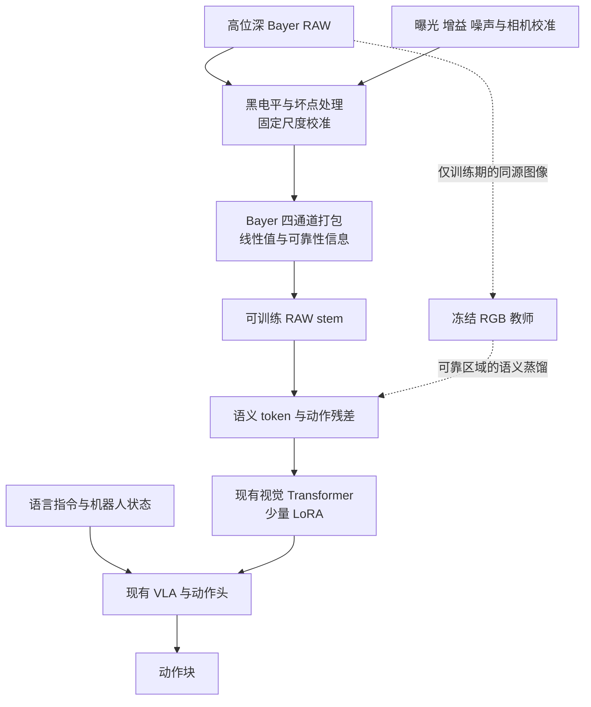

# OWAC 研究路线与 RSS 2027 投稿计划

截至 2026 年 10 月 8 日，OWAC 的建议主线是：**基于现有 VLA，研究经过物理校准的 RAW 特征如何保留动作所需的视觉证据，并通过真实机器人闭环实验判断它是否优于充分调优的 RGB 与神经 ISP。** 首篇论文以机械臂操作为核心，轮式人形机器人承担移动取放的迁移验证。

已知条件：机械臂平台、移动轮式人形机器人、充足 GPU 资源、约 10 人团队；相机型号与性能待定。以下模型设计、数据规模和成功标准均为立项建议，尚无 OWAC 实验结果。工作题目可暂定为 *OWAC: Calibrated RAW-to-Action Adaptation for Robust Robotic Manipulation*；OWAC 暂保留为项目名，不强行展开缩写。

## 立项判断与已有工作的边界

“RAW 替代 RGB”有研究价值，但已不能独立构成新颖性。尤其是 2026 年 9 月 29 日公开的 RawVLA，已经研究了 RAW 与机器人策略的连接。OWAC 应围绕可证伪问题立项：**当传感器、曝光、数据、模型适配预算和时序信息受控时，直接学习 RAW 动作表征，是否仍比优化后的图像接口更有效？**

| 相关工作 | 已有贡献 | OWAC 必须回答的问题 |
| --- | --- | --- |
| [Learning to See in the Dark，CVPR 2018](https://github.com/cchen156/Learning-to-See-in-the-Dark) | 用短曝光 RAW 学习低光照成像 | 图像恢复改善能否转化为闭环任务成功 |
| [Unprocessing，CVPR 2019](https://github.com/timothybrooks/unprocessing) | 逆向近似成像流程并合成 RAW 噪声 | 如何用合成数据启动，又避免将其当作真实传感器证据 |
| [RAW-Adapter，ECCV 2024](https://arxiv.org/abs/2408.14802) | 输入级可学习 ISP 与模型级适配器连接 RGB 预训练模型 | 增加 RAW adapter 本身已经不是新方法 |
| [AODRaw，CVPR 2025](https://openaccess.thecvf.com/content/CVPR2025/html/Li_Towards_RAW_Object_Detection_in_Diverse_Conditions_CVPR_2025_paper.html) | 真实 RAW 检测数据与 RGB 教师辅助的 RAW 预训练 | 如何迁移到语言条件下的连续控制，并避免教师限制学生 |
| [Raw-VLM，IJCAI 2025 MKLM workshop](https://github.com/kepengxu/PRISM-VL) | 作者仓库列出的前作包含可学习 ISP 和 RAW tokenization | 不能声称首次将 RAW token 接入 VLM |
| [PRISM-VL，2026 预印本](https://arxiv.org/abs/2605.11727) | RAW 派生测量域输入、相机元数据条件化与多曝光代理监督 | 测量域和元数据不是独立新颖点；需要机器人问题与闭环证据 |
| [RawVLA，2026 预印本](https://arxiv.org/abs/2609.37530) | 用动作损失训练流式神经 ISP，服务冻结 VLA，并提供仿真与实机实验 | 直接 RAW 特征路径是否有超出神经 ISP 的收益 |
| [RAWild，作者公开仓库](https://github.com/I2WM/RAWild) | 面向跨传感器 RAW 检测的适配 | 跨相机泛化需要真实留出测试，不能只用 sensor ID 解释 |

RawVLA 是最接近的直接竞争工作。其模型仍输出供 VLA 使用的图像；这不意味着其中一定存在 uint8 量化。因此，OWAC 的比较必须允许神经 ISP 使用浮点输出。其仿真含合成传感器观测，但实机已使用 12-bit Bayer 相机，不能把“真实 RAW 实机”当作 OWAC 的首创。原文的输出量化实验还显示，所测策略对位深的敏感性低于曝光等因素；这不能推导成传感器 ADC 位深无关，却直接提醒我们不能把论文建立在“12 大于 8”上。[RawVLA 原文](https://arxiv.org/html/2609.37530v1)

候选贡献应是一个整体：**动作导向的 RAW 表征迁移机制、同源观测下的受控归因实验，以及跨照明和跨传感器的闭环验证。** 是否足够新颖，仍取决于实现细节、直接基线结果与投稿前的文献复查；本轮调研不构成“首次”的证明。

## RAW 优势的物理表述

建议将动机写成：“常规成像处理可能弱化机器人所需的测量证据；直接利用传感器观测有望改善部分低照度和高反差任务。”需要区分以下概念：

- 10、12、14 bit 是采样或编码精度。有效动态范围由饱和上限、噪声底和采集模式共同决定，不能仅由文件位深判断。EMVA 1288 用饱和与最低可检测信号定义动态范围。[EMVA 官方资料](https://www.emva.org/standards-technology/emva-1288/emva-standard-1288-downloads-2/)

- RGB 不必是 8 bit；线性 RGB、浮点 RGB 和显示用 sRGB 是不同接口。Bayer RAW 也不是每个像素均有完整三色测量。

- ISP 中的裁剪、降噪、局部色调映射与量化可能丢失任务线索；合理的去马赛克、校准和降噪也可能帮助模型。不能预设去掉全部 ISP 一定更好。

- 少光子导致的低信噪比、传感器已饱和的区域，不能仅靠 RAW 输入恢复。长曝光、多帧融合或主动照明带来额外信息，必须作为独立实验变量。

- RAW 是接近传感器的数字读数，通常已包含传感器内部处理，不能简单等同于未经任何处理的物理光子计数。

Tesla 可作为工程动机参考，原始材料入口是 [Tesla AI Day 2021 官方视频](https://www.youtube.com/watch?v=j0z4FweCy4M)。本次可访问的一手页面不足以核实“完全绕过哪些 ISP 环节、在何版 HydraNet 上得到多少收益”的具体说法；首稿不使用未经核实的工程细节或定量提升作为论据。

## 建议验证的三个假设

**H1：在相同采集预算下，直接 RAW 表征能保留一部分图像接口难以利用的动作线索。** 主要比较对象是调优 RGB、浮点线性图像和动作监督神经 ISP。若只胜过默认曝光或默认 ISP，则 H1 的强版本不成立。

**H2：选择性语义迁移比全特征 RGB 蒸馏更适合 RAW 策略。** RGB 教师可提供语义先验，但也可能把自己看不见的细节压制掉。检验只对可靠语义子空间施加蒸馏、为 RAW 保留动作残差表征，是否优于无蒸馏、全蒸馏和相同容量的普通 adapter。

**H3：校准与噪声条件化能提高跨照明和跨传感器泛化。** 使用未参与训练的第二类传感器，分别报告零样本迁移和少量目标域适配。若只在训练相机有效，则不能宣称通用 RAW 接口。

三个假设均以成功率、失败类型和计算成本为判据。H1 若被强基线否定，可收敛为“RAW 与 ISP 的任务充分性边界”研究；不得在看到测试集之后反复修改假设以保留正结果。

## 模型路线与最小实现

首选 **π0.5 / openpi** 作为主骨干，原因是已有动作模型、适配接口与机器人/仿真支持；使用团队最熟悉的可复现检查点并锁定版本。第二骨干建议用 **OpenVLA-OFT** 验证方法是否依赖特定动作头。GPU 充足应优先用于强基线、随机种子和消融，不建议从零训练 VLM/VLA。[openpi 官方仓库](https://github.com/Physical-Intelligence/openpi)、[OpenVLA-OFT 官方项目](https://openvla-oft.github.io/)

**最小实现只改视觉入口及少量适配参数，保留原有语言模块和动作结构。**

1. **传感器入口。** 对 Bayer 数据按 R、G1、G2、B 打包，保留 CFA 排列、黑白电平、曝光时间、模拟/数字增益、时间戳和噪声校准。基本归一化使用相机校准尺度；避免逐帧 min-max 抹去曝光与噪声关系。曝光归一化作为消融，同时保留未归一化信号和元数据。

2. **RAW stem。** 小型卷积或 patch embedding 将四通道输入转成与原视觉编码器兼容的 token。先以相同 token 数与空间覆盖建立对照，再测试线性值加 log1p 值、噪声方差、饱和掩码。若采用三通道线性输入作为启动版本，应准确称为“最小成像处理”，不能称为无去马赛克。

3. **候选方法核心。** token 包含继承 RGB 语义的分量和由动作损失学习的 RAW 残差分量；只对教师可可靠观察的区域及语义分量施加对齐。这个设计是待验证方案，不是已证明有效的新结论。

4. **策略适配。** 初期冻结大部分 VLA，训练 stem 和 adapter；随后以相同预算开放视觉 LoRA 和必要的动作适配。所有强基线获得可比的数据、更新量和可训练参数预算。冻结参数不等于切断输入梯度，训练图必须让动作损失传回 stem。

5. **时序扩展。** 先做单帧归因，再测试短因果 RAW 序列。RGB 和神经 ISP 对照也获得相同历史帧数、曝光总时长和时延预算；禁止用未来帧。若单帧无收益，只在多帧有收益，应归因于时序信息利用。

训练目标可写成“原 VLA 的动作目标 + 可靠区域语义对齐 + 可选的传感器扰动一致性”。对 π0.5 沿用其原动作学习目标，对 OFT 沿用其动作回归配置。不要为了形式统一替换动作损失。

**精度检查是必要工程步骤。** 原始文件保留无损整数测量；校准和早期 stem 优先使用 FP32，投影后的特征再进入 BF16 主干，并做精度消融。BF16 只有有限有效尾数，不能因其指数范围大就认为它原样保留了所有 RAW 灰阶。现有 PIL、JPEG、uint8、视频编码和 RGB 图像处理器路径必须逐一排除隐式降位。

## 数据路线

采用“公开数据用于启动、自采同源机器人数据用于主要结论”的组合。

| 数据来源 | 用途 | 边界 |
| --- | --- | --- |
| SID 与 AODRaw | RAW 校准、视觉表征和退化建模预热 | 没有机器人动作，不能替代闭环策略数据 |
| PRISM-VL 公开资源 | 测量域语言理解的辅助对照 | 不把其派生图像直接当作未处理 Bayer 数据 |
| RawVLA-Bench | 复用已有仿真协议和直接竞争基线 | 核查 RAW 合成来源、处理阶段及可复现性 |
| 自采 RAW 操作轨迹 | 主训练集与真实闭环评估 | 保存完整测量、元数据、动作和时序 |
| 第二种传感器与轮式平台 | 分布外测试 | 按采集会话和硬件拆分，避免邻帧泄漏 |

建议先采 2 项操作任务、合计 100—200 条示范跑通，再扩展为 4—6 项任务、每项约 150—250 条示范。规模是预算起点，最终依据验证集学习曲线决定。保留正常光照、低光和高反差条件，避免训练任务与某种灯光一一对应。

同一条传感器数据派生固定 ISP、调优 ISP、线性图像和 RAW 分支，构建同帧配对。若硬件可同步输出厂商 RGB 则一并记录；否则明确标注软件 ISP 对照，不伪称厂商流水线。闭环评估时各策略会产生不同后续观察，不能宣称全轨迹同帧配对；应匹配初始场景、曝光规则和任务条件。

模拟 RAW 只能作为近似：从 8-bit sRGB 逆处理无法找回已裁剪高光或真实噪声。优先使用渲染器的线性 HDR 缓冲区，再施加经过实机标定的噪声和 CFA；无法取得时，明确标记为 pseudo-RAW。静态长曝光参考可用于诊断，但包含更多光子，不能作为同等采集条件的对照。

训练、验证、测试按场景、物体实例、采集会话、照明配置和相机划分。公开 RGB 机器人数据仍可提供语义和动作预训练，不能将其逆处理版本计入真实 RAW 采集量。

## 闭环任务与评估协议

机械臂主实验建议覆盖四类任务：暗色物体抓取、逆光条件下的目标选择、依赖细边缘或插槽位置的放置、明暗转换中的连续取放。加入语言指定颜色/类别/位置的干扰项，防止策略仅记忆运动轨迹。精密插接只有在平台本来已具备稳定控制能力时加入，避免把接触控制失败误归因于视觉。

照明建议设为正常光、两档低光、同画面高反差、动态明暗变化。记录任务平面照度、亮暗区域亮度比、快门、增益、RAW 饱和比例和噪声统计；lux 单独不足以描述 HDR。具体阈值先经相机标定确定，不预设任意 lux 数字作为普遍极限。

| 对照 | 输入与训练 | 主要排除的替代解释 |
| --- | --- | --- |
| B0 默认 RGB | 同源固定 ISP 与原有策略 | 提供系统起点 |
| B1 强 RGB | 验证集调优 ISP、物理合理增强、匹配 LoRA | 收益是否仅来自默认设置差或训练预算多 |
| B2 高精度图像 | 浮点线性 RGB 或 XYZ，匹配适配预算 | 收益是否只需保留线性/高精度信息 |
| B3 神经 ISP | RawVLA 为首要直接基线，允许浮点输出 | 学习渲染是否已经足够 |
| B4 朴素 RAW | 四通道 stem 与相同 VLA，无候选核心模块 | 改输入和加容量是否已经解释收益 |
| B5 OWAC | 校准 RAW 与选择性语义迁移 | 检验提出的机制 |

B3 至少报告原论文式冻结策略配置；还需增加可比策略适配预算的配置，避免用“我们微调、对手冻结”制造优势。额外加入同一 RAW 的多种数字曝光渲染融合对照，约束 token/算力后检验是否只需更好的图像呈现。多次物理曝光获取了额外信息，应另列实验。

主要指标为每任务和每照明条件的成功率、最差条件表现、碰撞/误抓/失去目标等失败类型。辅助报告动作误差、目标定位、语言目标选择、任务耗时、端到端 p50/p95 时延与显存。PSNR/SSIM 和 VQA 不能替代机器人成功率。

每个单元先做 10 次探索，最终计划至少 30 次，并覆盖至少 3 个训练种子；分别报告种子差异和二项区间，不能将视频帧作为独立样本。示例预算为 4 任务 × 5 条件 × 6 方法 × 30 次 = 3600 次闭环试验，额外配置另计。最终样本量依据先导差异和不确定性决定；30 次不足以保证检测到小幅提升。

使用预先固定的验证集选择参数；测试时随机化方法运行顺序，匹配初始物体布局并记录人工重置误差。正常光性能下降和动作时延增加须与极端条件收益一并报告。

## 消融与轮式平台扩展

必须优先完成的消融：

- 传感器原生高位深、同一 RAW 的受控再量化，以及处理后图像量化分开比较；不能混淆 ADC 与显示端位深。

- packed Bayer、最小去马赛克线性图像、浮点神经 ISP 三种接口。

- 无蒸馏、全语义蒸馏、可靠区域蒸馏，以及保留/移除动作残差分量。

- 无元数据、仅曝光/增益、加入实际噪声校准；打乱元数据用于排查捷径。

- 同一相机与留出相机；相同 token 数、参数量、历史长度与训练预算。

- 单帧与因果短序列；固定曝光规则与允许自适应曝光分别评测。

轮式人形机器人先做两类迁移任务：跨明暗区域后到达目标并取物、逆光环境下识别语言指定目标并取放。沿用成熟导航与底层控制，在所有方法中保持一致，将视觉入口和操作策略作为比较变量。共享 RAW 视觉前端，采用平台自己的动作接口；分别报告零样本视觉迁移与有少量本体示范的适配结果，不预设整个 VLA 可以零样本跨本体控制。

主动曝光与主动观察具有机器人研究价值，但会同时改变采集信息和控制策略。首轮将其放在扩展实验：主结果成立后，再研究策略如何选择曝光、视角或短暂停留；不与 RAW 表征核心一起全部启动。

## 相机选型与验收

相机选择先满足连续机器人采集，再比较像素数。建议主平台采用同型号外部相机与腕部相机，后续引入第二类传感器做留出测试。以下为工程验收目标，不是已验证的产品规格或采购承诺。

| 项目 | 验收内容 |
| --- | --- |
| 原始输出 | 优先真实 RAW12 或更高；连续 Bayer 输出，而非 RGB 包装成 16-bit |
| 控制能力 | 可固定曝光、模拟/数字增益，关闭自动白平衡、自动曝光及非必要处理 |
| 元数据 | 每帧曝光、增益、时间戳、CFA 与有效位数；黑电平和白电平可标定 |
| 时序 | 目标至少 30 FPS 连续稳定采集；多相机硬件同步或可测量的时间对齐 |
| 动态性能 | 实测读取噪声、线性区、饱和阈值与暗区 SNR；运动场景优先评估全局快门 |
| 镜头与场景 | 在实际工作距离比较视场、光圈、景深、暗角和边缘清晰度 |
| 系统链路 | 驱动、带宽、丢帧、时间抖动、机械安装、散热与线缆都要验收 |

全局快门和低照度能力存在具体器件取舍，不能仅按标签选择。若相机有 HDR/WDR 模式，查清它输出单曝光、分曝光 RAW，还是已经融合/压缩的流；HDR 模式单独标注与控制。

到货后用暗场、均匀光场、曝光扫描和运动靶检查真实位深、黑电平、坏点、噪声、裁剪与时间同步。优先借测或小批验收两款候选，再确定批量型号。

存储使用保留原始值的无损数组/容器，RGB 预览可另存视频。例如 3 路 640×480、uint16、30 FPS 的未压缩有效载荷约 55.3 MB/s，即 199 GB/小时，尚未计元数据、索引和备份；不能用普通有损视频替代主 RAW 数据。

## RSS 2027 时间表与交付

RSS 2027 官网当前采用两阶段制度：首轮提交 6 页 extended abstract，最多 5 页正文加 1 页参考文献，需充分展开问题、假设与方法，实验可为初步结果；进入第二阶段后完成评审指定扩展，最终正文最多 8 页、参考文献不计。首轮不接收补充材料。[RSS 2027 官方 CFP](https://roboticsconference.org/information/cfp/)

| 官方节点 | AoE 截止 | 北京时间 |
| --- | --- | --- |
| 首轮 Extended Abstract | 2026-12-04 23:59 | 2026-12-05 19:59 |
| Rebuttal | 2027-02-12 23:59 | 2027-02-13 19:59 |
| 最终论文 | 2027-04-16 23:59 | 2027-04-17 19:59 |

从当前日期到首轮约 8 周，必须以 12 月为首个交付点。内部建议 12 月 2 日冻结稿件；会议网页可能更新，正式提交前由项目负责人复核。2027 年会议目前定于 7 月 6—11 日在雅典举行。

| 阶段 | 交付与决策 |
| --- | --- |
| 10 月 8—18 日 | 锁定相机候选、RAW 数据规范、主骨干和直接基线；完成真实 RAW 采集与全链路精度检查 |
| 10 月 19 日—11 月 1 日 | 2 个任务的 RGB/神经 ISP/朴素 RAW 先导实验；判断收益与主要失败机制 |
| 11 月 2—15 日 | 实现选择性语义迁移；完成同源对照、浮点图像控制与第一轮消融 |
| 11 月 16—29 日 | 固定假设与评估协议，扩展到 4 个机械臂任务，形成初步统计和机制解释 |
| 11 月 30 日—12 月 2 日 | 完成 5 页正文与 1 页引用，内部审阅、复核引用和匿名化 |
| 12 月至次年 1 月 | 扩大实机统计，加入第二相机、第二 VLA 和轮式平台 |
| 2 月 | 根据阶段反馈完成回应，并围绕 Extension Charter 调整剩余实验 |
| 3 月至 4 月上旬 | 完成所要求的扩展、数据/代码整理、全文与补充材料 |

首轮理想证据包：真实 RAW 链路已验收、一个稳定 VLA 基座、至少两类关键光照中的闭环对照、一项支持或否定机制的消融、完整的最终实验协议。轮式平台与所有扩展无需挤进首轮。

内部推进门槛可暂设为：关键恶劣照明条件相对最强基线出现约 10 个百分点的可重复改善趋势，正常光照下降控制在 3 个百分点以内，并满足实际控制时延预算。这是资源分配的工程目标，不是预测结果、显著性标准或录用保证。若只有默认 RGB 很差、强基线补齐后差异消失，应修改研究主张。

## 十人团队建议分工与首周任务

| 职能 | 人数 | 主要责任 |
| --- | --- | --- |
| 项目负责人 | 1 | 假设、实验协议、论文主线与投稿 |
| 成像与硬件 | 2 | 相机、标定、RAW 驱动、同步和数值精度 |
| 机器人与数据 | 2 | 示范采集、机械臂闭环、场景与失败标注 |
| 模型研究 | 3 | 主 VLA、RAW 表征、神经 ISP 复现与消融 |
| 评测与基础设施 | 1 | 数据版本、运行记录、统计和复现 |
| 轮式平台 | 1 | 早期准备接口，主线成立后承担移动操作迁移 |

首周完成五件具体工作：确定两款可借测 RAW 相机及一个主选；记录首批同步 RAW/机器人状态/动作；跑通正常光下稳定的基座策略；把 RawVLA 及强 RGB 对照的可复现范围查清；用同一 RAW 在不同成像路径下找出可量化的目标线索变化。

优先评审的是“哪些视觉信息影响了动作，且为什么既有方法不能充分利用”，随后才是完整架构和跨平台展示。若最终证明一个简单的浮点图像接口已足够，应如实保留该结果，并据此收窄 OWAC 的贡献。

