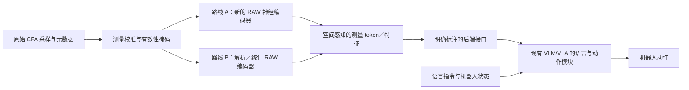

# OWAC 研究路线与 RSS 2027 投稿计划

**版本：v2，2026 年 10 月 8 日。研究中心改为 RAW 原生编码器：直接从传感器采样产生可供现有 VLM/VLA 后端使用的表征，不以 RGB 图像为中间接口。** 本版替换原视觉编码器，而非仅在 RGB 视觉骨干前增加 RAW stem。主方法取消 RGB 教师蒸馏，分别探索新的神经网络架构和严格的非神经网络 RAW 编码方法。

已知条件：机械臂平台、移动轮式人形机器人、充足 GPU、约 10 人团队；相机型号和性能待定。首篇论文以机械臂闭环操作为主体，轮式平台作为迁移验证。本文给出候选设计、验证协议和决策门槛，尚无 OWAC 实验结果。

工作题目暂定为 *OWAC: RAW-Native Sensory Encoding for Vision-Language-Action Models*。OWAC 保留为项目名；在实验结果明确之前，不将“非神经网络胜过神经网络”写成既定结论。

## 1. 新的研究问题与方法边界

核心问题是：

> 面向语言条件下的机器人控制，传感器测量应如何被编码？能否绕过面向人类观看的图像接口，构造保留空间结构、测量可靠性和任务线索的表征，并让现有 VLM/VLA 的语言与动作模块有效使用它？

主链路为：



A、B 是可替换的研究分支，不要求同时运行或在首篇论文中融合。主方法有以下边界：

| 项目 | 本版约束 |
| --- | --- |
| RAW→RGB / sRGB / XYZ | 主方法训练与推理均不生成此类图像作为下游输入；也不以先去马赛克再换名字的方式绕过约束 |
| 测量校准 | 允许黑电平、增益/响应校准、坏点掩码、CFA 重排、噪声估计和数值变换；说明每项操作，不笼统声称“没有任何 ISP 操作” |
| 原视觉编码器 | 主方法移除原 RGB 图像塔，重新设计整个 RAW 编码器；原图像塔只出现在外部基线 |
| RGB 教师与重建 | 主方法不采用 RGB 教师蒸馏，不设 RGB 重建损失；RAW 测量预测可以作为辅助训练目标 |
| 既有预训练能力 | 可以继承已有 VLM/VLA 的语言、动作及其他后端权重，并披露其原始 RGB 预训练来源 |
| 实验对照与人工标注 | 允许在独立流水线生成 RGB，用于强基线、人工预览和标注；这些图像不流入主方法 |
| “非神经网络”的范围 | 指 RAW 编码器；后端仍是现有 VLM/VLA。不能把整套系统称为非神经网络机器人 |

不要求输出一定是视觉 Transformer token。可以是局部特征场、稀疏结构集合或带不确定性的测量描述符；首轮建议统一为“空间测量 token”，便于控制后端和计算预算。它们是新的观测接口，**不因向量维度相同就自动具有原视觉 token 的语义。**

## 2. 文献定位：什么已经有人做，什么需要我们证明

“使用 RAW”“跳过固定 ISP”“使用相机元数据”“将 RAW 转为 token”均不能单独支撑首创。需要围绕编码机制及其闭环效果建立贡献。

| 一手工作 | 对本项目的直接意义 |
| --- | --- |
| [ISP-less Low-Power Computer Vision，2022](https://arxiv.org/abs/2210.05451) | 不经过常规 ISP 的 RAW 视觉已有研究，不能将旁路 ISP 本身作为贡献 |
| [RAW-Adapter，ECCV 2024](https://arxiv.org/abs/2408.14802) | 输入级可学习 ISP 与模型级适配已有先例；本版应超出前置 adapter |
| [AODRaw，CVPR 2025](https://openaccess.thecvf.com/content/CVPR2025/html/Li_Towards_RAW_Object_Detection_in_Diverse_Conditions_CVPR_2025_paper.html) | 真实 RAW 检测与 RGB 教师辅助预训练已有基础；本版不沿用教师蒸馏作为核心 |
| [Raw-VLM 作者仓库](https://github.com/kepengxu/PRISM-VL)、[PRISM-VL，2026](https://arxiv.org/abs/2605.11727) | 已研究 RAW 相关表征、tokenization、相机条件化与视觉语言理解；不能声称首次 RAW 接入 VLM |
| [RawVLA，2026](https://arxiv.org/abs/2609.37530) | 动作监督的流式神经 ISP、冻结 VLA 以及真实机器人实验构成首要直接基线 |
| [RAWild 作者仓库](https://github.com/I2WM/RAWild) | 跨传感器 RAW 感知已有工作；泛化必须用真实留出相机验证 |

RawVLA 的神经 ISP 仍输出供 VLA 使用的图像，而本版 OWAC 直接输出非图像表征并替换原图像塔。这是明确的方法边界，但不等于已证明新颖性或优势。RawVLA 的实机已经使用 12-bit Bayer 相机，且其方法输入包含去马赛克后的线性测量；因此“真实 RAW 实机”不是 OWAC 的首创，复用数据前也要检查是否仍保有原始 CFA。其神经 ISP 输出不应被人为限制为 uint8。[RawVLA 原文](https://arxiv.org/html/2609.37530v1)

本轮检索支持继续研究下列组合，但不构成“首次”的证明：

1. 在原始 CFA 采样上，设计与噪声、空间尺度和动作定位需求共同相关的编码机制。
2. 使这种表征接入既有语言—动作后端，并验证替换图像塔后的能力恢复路径。
3. 在强成像基线、普通 RAW 网络和简单测量投影对照下，解释闭环收益来自哪里。
4. 若非神经网络路线成立，明确其计算、样本效率和失效边界，而非仅强调没有反向传播。

### 生物视觉与数学工具能提供的启发

| 基础工作 | 可以借鉴的原则 | 不能直接推导的结论 |
| --- | --- | --- |
| [Atick 与 Redlich，1992](https://redwood.berkeley.edu/wp-content/uploads/2018/08/Atick-Redlich-NC92.pdf) | 编码应在冗余压缩与噪声抑制之间权衡，滤波策略与信噪比相关 | 中心—周边滤波一定优于学习模型，或暗光下应无限放大高频 |
| [Olshausen 与 Field，1997](https://www.rctn.org/bruno/papers/VR.pdf) | 稀疏表示可形成局部、方向性结构编码 | 稀疏系数天然具备语言语义，或最优化求解一定适合实时控制 |
| [Mallat，Group Invariant Scattering](https://arxiv.org/abs/1101.2286) | 固定多尺度小波与非线性算子能构造具有特定稳定性的描述符 | 全局平移不变性适合机器人定位，或稳定性理论直接保证操作成功 |
| [Mäkitalo 与 Foi，2013](https://researchportal.tuni.fi/en/publications/optimal-inversion-of-the-generalized-anscombe-transformation-for-/) | Poisson–Gaussian 噪声需要显式处理，方差稳定化有适用条件 | 一次 log 或 Anscombe 变换就能消除低光噪声 |

这些是设计依据，不是 OWAC 的实验证据。生物视觉的细胞电路本身也是神经系统；本项目从中提取计算原则，构造解析算子，不宣称完整复现视网膜。脉冲神经网络仍是神经网络，不属于严格的路线 B。Scattering 文献也常使用“network”一词；若强调严格非神经实现，首轮采用明确的固定滤波与统计运算，不依靠术语重命名获得新颖性。

## 3. RAW 优势的物理表述

建议将动机写成：“常规成像处理可能弱化机器人所需的测量证据；直接利用传感器观测有望改善部分低照度和高反差任务。”需要区分以下概念：

- 10、12、14 bit 是采样或编码精度。有效动态范围由饱和上限、噪声底和采集模式共同决定，不能仅由文件位深判断。EMVA 1288 用饱和与最低可检测信号定义动态范围。[EMVA 官方资料](https://www.emva.org/standards-technology/emva-1288/emva-standard-1288-downloads-2/)

- RGB 不必是 8 bit；线性 RGB、浮点 RGB 和显示用 sRGB 是不同接口。Bayer RAW 也不是每个像素均有完整三色测量。

- ISP 中的裁剪、降噪、局部色调映射与量化可能丢失任务线索；合理的去马赛克、校准和降噪也可能帮助模型。不能预设去掉全部 ISP 一定更好。

- 少光子导致的低信噪比、传感器已饱和的区域，不能仅靠 RAW 输入恢复。长曝光、多帧融合或主动照明带来额外信息，必须作为独立实验变量。

- RAW 是接近传感器的数字读数，通常已包含传感器内部处理，不能简单等同于未经任何处理的物理光子计数。

Tesla 可作为工程动机参考，原始材料入口是 [Tesla AI Day 2021 官方视频](https://www.youtube.com/watch?v=j0z4FweCy4M)。本次可访问的一手页面不足以核实“完全绕过哪些 ISP 环节、在何版 HydraNet 上得到多少收益”的具体说法；首稿不使用未经核实的工程细节或定量提升作为论据。

## 4. 三个可证伪假设

**H1：非图像的 RAW 表征可以成为有效的机器人观测接口。** 在相同传感器、曝光、历史长度、token 数和可比训练预算下，新编码器能在正常光照维持基本能力，并在部分低光/高反差任务中优于强 RGB、浮点图像与神经 ISP。若只胜过默认 ISP，强版本 H1 不成立。

**H2：噪声感知的尺度选择，比固定尺度或仅增加网络容量更有效。** 暗区需要空间汇聚提高可用信噪比，但汇聚会损失定位精度。编码器应在这两者之间分配表示预算，而不是把所有高频都增强或把所有暗区都抹去。通过去掉噪声校准、固定尺度和匹配 token 预算的消融检验。

**H3：在保留空间、低频测量及可靠性信息的条件下，解析编码器可能让同一后端学会有效控制。** 目标是检验一种不同的传感器接口是否具有竞争力，而非假定它全面优于神经网络。若编码端省下的工作全部转移到更大的下游网络，则必须按端到端成本报告，不能宣称整体更高效。

三者分别检验接口、机制和实现方式。跨相机泛化是重要外部验证；不能把只在一个训练传感器有效的结果写成通用编码器。

## 5. 路线 A：重新设计 RAW 神经编码器

### 核心构思

建立一个**面向 CFA 采样、随噪声调整空间支持范围的多尺度编码器**。其任务是生成空间表征，不生成供人观看的图像。普通 CNN/ViT 直接吃 packed RAW 是必要基线，不是预设的最终方法。

建议首版采用三步结构：

1. **CFA 感知的局部测量分解。** 保留 R/G1/G2/B 实际采样位置与通道身份，使用按采样类型区分的局部算子。不能把 Bayer 中相邻不同滤色片的亮度差直接解释为物体边缘。保留绝对测量/低频分支，以及局部变化/方向分支。
2. **噪声条件化的多尺度汇聚。** 对同一区域构造小、中、大支持范围的候选特征；结合实际噪声估计、饱和掩码和空间结构，学习其组合及 token 分配。低信噪比区域可扩大汇聚范围，但同时保留细定位分量，避免只剩模糊语义。
3. **空间测量 token 输出。** 将系数、区域位置、尺度、相机/时间信息和可靠性描述联合编码。保持最低的均匀空间覆盖，再在固定预算内增加细节 token；不允许仅按亮度或 SNR 丢弃整个暗区。

首轮创新点集中在“**噪声条件下的空间尺度与定位信息如何共同保留**”。CFA、元数据、多尺度、attention 各自均有大量先例，不能仅靠模块组合声称方法贡献。需要给出具体算子与匹配基线，证明该组合解决了可观察的失效模式。

### 训练方式

- 可先做 RAW 测量域的掩码预测或噪声感知自监督；训练期预测目标仍为实际 CFA 测量，而非 RGB。若预测带噪观测，要防止模型只学习噪声，按噪声模型选择损失及有效区域。
- 随后使用 RAW—文本/目标标注恢复语言条件下的视觉区分，再进行动作学习。是否需要大规模预热，由学习曲线决定。
- 动作阶段沿用所选 VLA 的原动作目标。可以联合优化新编码器和后端部分参数；冻结后端参数时仍允许输入梯度传回编码器。
- 保留“仅动作训练”的简单版本，用于检验预训练成本是否必要；主方法不引入 RGB 教师或图像重建。

前两周不同时叠加时序状态、主动曝光和复杂 token 路由。先验证单帧、固定 token 预算下的核心算子，再增加一个有明确收益的扩展。

## 6. 路线 B：受生物视觉启发的非神经网络编码器

### B1：首选的解析测量编码

这一分支使用固定滤波、显式统计估计和确定性规则。所有传感器到描述符的运算均可写出，不训练卷积、attention 或神经 MLP。

**步骤一：保留真实测量与噪声模型。**

对采样位置 i、滤色片类别 c，记录原始读数 y、黑电平 b、白电平 w，采用固定校准尺度：

```text
r_i = (y_i - b_c) / (w_c - b_c)
Var(r_i | μ_i, gain, exposure) ≈ α_c · μ_i + β_c
```

α、β 应由对应增益/曝光设置的实测数据拟合；μ 是未知无噪均值，其局部估计只是近似。读出相关噪声明显时，使用相应协方差模型，不能默认所有采样独立。保留黑电平附近的有符号残差；对饱和、坏点及缺失值单独标记，不将饱和信号当作高置信度观测。

**步骤二：中心—周边与方向结构分析。**

在同类 CFA 采样点及其实际坐标上构造局部核，计算多尺度低通、中心—周边差分与方向性响应。首先分别分析各 CFA 子格；跨类型组合使用经过校准的区域描述符，不插值出缺失的逐像素 RGB 值。

对线性滤波核 a：

```text
d = aᵀr
σ_d² = aᵀΣa
z = d / sqrt(σ_d² + ε)
ON = max(z, 0), OFF = max(-z, 0)
```

z 是噪声归一化响应，不是恢复后的图像，也不是经证明的任务置信度。ε、增益上限和噪声模型需要标定/验证，避免暗区数值放大。尺度选择可依据可预测的输出噪声和局部结构采用确定性规则，并与固定尺度对照。

保留有符号方向响应或复小波的相位信息，使精细位置能够被下游辨认；不能仅输出丢失位置与符号的全局散射能量。CFA 色彩通道与生物视锥并不等价，不能直接照搬生理参数。

**步骤三：并行保留低频与绝对测量。**

仅保留对比度会丢掉亮度、缓变表面和部分颜色线索。因此，每个区域还输出按 CFA 类型统计的低频/DC、曝光/增益、饱和比例和噪声摘要。它们是测量描述符，不是三通道成像结果。对“红色杯子”等任务，必须专门检验这些统计是否足以支持颜色与语言条件，而不能只做灰度几何任务。

**步骤四：确定性打包为空间描述符。**

每个 token 包括：

```text
t_j = [
  多尺度有符号响应与方向/相位特征,
  分 CFA 的低频测量,
  噪声/饱和/有效性描述,
  位置、尺度、相机与时间信息
]
```

先固定规则网格输出，再尝试“均匀覆盖 + 有限自适应细节配额”。若做噪声阈值收缩，保留一条低维、未阈值化的测量摘要，检查微弱任务线索是否被删掉。不能把“弱信号”自动等同于“无用信息”。

这些 token 不一定包含物体类别，也不保证是动作的充分统计量；后端需要学习如何从它们推理和控制。所有压缩都会有损失，应该测量具体保留和舍弃了什么。

### B2：可选的显式稀疏推断

若 B1 已能跑通，可探索以固定解析字典表示 RAW patch：

```text
c* = argmin_c (r - Φc)ᵀΣ⁻¹(r - Φc) + λ ||c||₁
```

Φ 的原子定义在实际 CFA 测量空间，不以 RGB 重建为优化目标。输出稀疏系数、空间索引和残差统计。使用显式最优化求解；若改为可训练展开网络，就应归到路线 A。

固定字典与数据驱动字典需分开报告；后者可以是传统统计学习，但不能声称完全不学习。逐 patch 迭代求解可能比小网络慢，因此 B2 是探索项，不与 B1 同时作为首轮主线。

### 非神经网络边界的验收

| 实现 | 如何表述 |
| --- | --- |
| 固定滤波、解析归一化、显式最优化、确定性打包 | 非神经 RAW 编码器 |
| 数据统计得到的 PCA、白化或字典 | 统计学习编码器，说明拟合数据与方法 |
| 固定维度映射、补零或固定线性嵌入 | 可以保留严格非神经编码边界 |
| 可训练线性投影 | 明确披露学习参数；最严格版本采用固定映射作对照 |
| 神经 MLP、可训练跨注意力 resampler | 神经适配模块，计入模型与算力；不能藏在“接口”名称下 |
| SNN、可训练滤波器、可训练迭代展开 | 神经网络路线 |
| 原有 VLM/VLA 的语言和动作模型 | 允许保留，但整套系统仍包含神经网络 |

首个严格版本采用固定描述符、固定嵌入映射，训练后端去适应这种输入。另设学习投影版本衡量接口训练的重要性。不能把大部分 RAW 视觉处理搬到一个庞大的“connector”中，然后宣称非神经编码器完成了全部工作。

## 7. 与现有 VLM/VLA 的接口及语义恢复

建议选团队最熟悉的 [openpi 检查点](https://github.com/Physical-Intelligence/openpi) 作为主后端，以 [OpenVLA-OFT](https://openvla-oft.github.io/) 作为第二后端验证。锁定代码版本、权重和预训练来源，不从零训练完整 VLA。

openpi 的公开实现中，`embed_prefix` 将图像塔输出与语言 token 组成前缀，因此存在替换视觉入口的工程位置；训练和推理入口还会执行观测预处理，必须一并改成 RAW/特征路径。只换图像塔、继续走 RGB 图像处理器是不完整的实现。[openpi 的 pi0.py](https://github.com/Physical-Intelligence/openpi/blob/main/src/openpi/models/pi0.py)

统一接口至少包含：

```text
features:    [batch, n_tokens, descriptor_dim]
positions:   每个 token 的实际图像坐标与支持尺度
camera_time: 相机标识、时间戳或时间差
validity:    token 与底层观测的有效性掩码
uncertainty: 明确定义的测量噪声/饱和摘要
```

接口层负责维度、序列顺序、位置编码和 attention mask。可靠性信息如何进入后端必须实现为可消费的字段或特征；不能仅把它保存在日志里。原有序列位置编码不自动等价于二维几何位置，多视角和时序索引也不能混淆。

最大的代价是：**移除原图像塔，也移除了它的大量视觉语义预训练能力。** 继承语言模型和动作头不会自动补回这一缺口。不能预计仅凭 100—200 条动作示范就恢复开放词汇视觉理解。

建议分三阶段诊断：

1. **表征是否保留信息。** 用简单探针评估位置、边缘偏移、颜色/材质区分、语言目标选择；探针结果是诊断，不能替代闭环。
2. **后端能否使用信息。** 先做有限物体和指令的 RAW—语言对齐，检查相似物体、未见布局和同物不同照明。A 可同时学习编码器；B 固定编码器，训练后端参数。
3. **是否支持动作。** 从两个任务的正常光照开始，确认语言选择与动作控制正确，再引入低光和高反差。逐步扩大后端可训练容量，比较冻结、LoRA 和部分解冻；冻结失败不能单独证明编码器失败。

主张应与数据相称：若只能完成有限任务中的语言条件控制，就报告这一能力，不能外推为通用 RAW VLM。若路线 B 只有在更大后端或更多训练数据下有效，这也是必须披露的代价。

## 8. 数据、数值精度与采集设计

采用“真实 RAW 视觉数据用于启动，自采 RAW—语言—动作数据用于主要结论”的组合。公开数据必须逐项审计 CFA、黑白电平、位深、曝光和处理历史。

- [SID](https://github.com/cchen156/Learning-to-See-in-the-Dark)、[AODRaw](https://github.com/lzyhha/AODRaw) 可支持成像噪声、检测与表征预热，但不代替动作示范。
- PRISM-VL 与 RawVLA 资源可用于关联任务及外部对照；派生 XYZ 或去马赛克数据不能冒充本版的原始 CFA 输入。若没有原始采样，不能靠重新马赛克声称恢复了真 RAW。
- 现有 RGB 数据可以说明继承后端的训练来源；本版不把逆处理 sRGB 作为主要 RAW 证据。若使用合成测量，优先从线性 HDR 渲染缓冲区出发，模拟 CFA 和实测噪声，单列为合成数据。
- 人工可以借助独立 RGB 预览完成文字、目标或动作标注；主训练输入仍为 RAW 及其非图像描述符，不由 RGB 教师生成中间特征。

先采 2 项任务、100—200 条示范用于连通性和低数据试验，不将此视为语义学习已经足够。随后扩展 4—6 项任务，每项约 150—250 条起步，并同时积累更多没有动作标注的 RAW 场景及语言/目标标注。根据学习曲线决定是否增加数据；GPU 充足不能替代训练分布覆盖。

同一 RAW 分别派生强 ISP、浮点图像和神经 ISP 对照；厂商同步 RGB 与软件 ISP 来源要区分。离线样本可以同帧配对，闭环不同策略会改变后续观测，因此只能匹配初始场景、采集规则和任务条件，不能声称全轨迹同帧。

按物体实例、场景、采集会话、照明和传感器拆分训练/验证/测试，防止相邻帧泄漏。第二种相机作为真正的硬件留出，分别报告零样本与少量适配结果。

原始数据保留无损整数采样；校准、早期滤波和方差计算优先 FP32，后续特征再进入 BF16。排查 PIL、JPEG、uint8、视频编码、resize 和图像归一化的隐式处理。BF16 的指数范围不代表原样保留全部 RAW 灰阶；数值精度需单独验证。

时序暂不作为首版必要条件。之后可加入曝光补偿后的因果差分或解析时序状态，但普通 RAW 帧不会因此成为事件相机，也不会自动获得事件传感器的时间分辨率。所有基线须获得相同历史帧数、曝光预算与时延约束。

## 9. 能区分路线优劣的实验协议

### 对照组

| 方法 | 设置与用途 |
| --- | --- |
| C0：充分调优的 RGB VLA | 同源 ISP、合理增强和足够后端适配，避免只打败默认配置 |
| C1：浮点线性图像 / XYZ | 独立图像接口基线，检查保留精度和线性信息是否已足够 |
| C2：RawVLA / 动作监督神经 ISP | 允许浮点输出；报告原论文式冻结配置与可比后端适配配置 |
| C3：普通 RAW CNN/ViT | 同样替换原图像塔，匹配 token 和训练数据，隔离新架构贡献 |
| C4：RAW patch 固定投影 | 简单打包、固定线性映射、同一后端；检验复杂编码是否必要 |
| A：新神经编码器 | CFA 感知、噪声条件化多尺度分析 |
| B：解析编码器 | B1 为主，固定规则；与学习接口版本分开报告 |

C0—C2 可以使用原视觉塔，这是合理而强的系统对照。C3、C4 与 A、B 共享替换后的后端和适配协议，是机制归因的关键对照。既报告任务匹配的强系统比较，也报告 token、后端可训练容量、更新次数和总计算受控的比较；不能用一个参数数值声称所有系统已完全公平。

先对所有组做离线与小规模闭环筛选，首轮选择最有解释力的组进入主实验；不得因为某强基线表现好而将其删除。所有筛选依据来自预先划定的验证集。

### 任务与指标

机械臂主任务覆盖暗色目标抓取、逆光下语言指定目标选择、依赖精确边缘/插槽位置的放置、明暗变化中的连续取放。加入颜色、类别和位置干扰项；精密接触任务仅在底层控制已稳定时使用，避免控制失败掩盖视觉问题。

光照包含正常光、两档低光、同画面高反差、动态明暗变化。记录照度、亮暗区域亮度比、曝光/增益、饱和比例和噪声；lux 单独不能定义 HDR。曝光自适应属于另一因素，先固定或使用相同曝光规则。

主指标是闭环成功率、最差条件表现、碰撞/误抓/失去目标等失败类型。辅助报告定位误差、语言目标选择、动作耗时和训练数据需求。B 尤其要报告 CPU/GPU 实际运行时间、内存、端到端 p50/p95 时延；减少可训练参数并不自动减少运算。能耗如需宣称必须实测完整系统。

每个单元先做约 10 次探索，最终至少以 30 次作为预算起点、分布于至少 3 个训练种子，并报告种子差异和置信区间；这不保证发现小幅优势。以 4 任务 × 5 条件 × 4 个最终主比较组 × 30 次为例，共 2400 次闭环试验，30 次为跨种子的总数。若 7 组全部进入该规模则为 4200 次，额外消融另计。最终样本量根据先导方差和目标效应决定。

匹配初始布局、随机化方法运行顺序、记录重置误差。不得把视频帧当作独立试验，也不能用 PSNR/SSIM 或 VQA 成绩代替机器人结果。

### 优先消融

1. 噪声感知尺度选择 vs 固定尺度；真实校准 vs 简化/错误噪声估计。
2. 保留/移除分 CFA 低频测量；保留/移除符号、相位与空间位置。
3. 均匀空间覆盖 vs 自适应配额，在相同 token 预算下比较；检查暗区目标是否被遗漏。
4. B 的固定接口 vs 学习投影；后端冻结、LoRA 与部分解冻分别报告。
5. C3/C4 vs A/B，排除仅由后端容量、数据量和 token 数带来的提升。
6. 原生位深与同一 RAW 再量化；处理后 RGB 量化另列，不与 ADC 位深混淆。
7. 同传感器与留出传感器；无元数据、真实元数据及打乱元数据诊断。
8. 单帧与因果短序列，等曝光与等历史长度比较。

关键失效诊断：若 B 的简单探针保留了任务信息但 VLA 学不会，优先检查接口与语义对齐；若探针也丢失了颜色或精细位置，优先改编码。若固定 RAW 投影已经同样好，说明复杂编码尚未建立必要性。

轮式人形机器人后续验证跨明暗区域到达目标并取物、逆光下语言指定目标取放。所有方法共享成熟导航和底层控制，平台保留自己的动作接口。区分视觉迁移与本体动作适配，不预设跨本体零样本控制。

## 10. 相机选型与验收

相机选择先满足连续机器人采集，再比较像素数。建议主平台采用同型号外部相机与腕部相机，后续引入第二类传感器做留出测试。以下为工程验收目标，不是已验证的产品规格或采购承诺。

| 项目 | 验收内容 |
| --- | --- |
| 原始输出 | 优先真实 RAW12 或更高；连续 Bayer 输出，而非 RGB 包装成 16-bit |
| 控制能力 | 可固定曝光、模拟/数字增益，关闭自动白平衡、自动曝光及非必要处理 |
| 元数据 | 每帧曝光、增益、时间戳、CFA 与有效位数；黑电平和白电平可标定 |
| 时序 | 目标至少 30 FPS 连续稳定采集；多相机硬件同步或可测量的时间对齐 |
| 动态性能 | 实测读取噪声、线性区、饱和阈值与暗区 SNR；运动场景优先评估全局快门 |
| 镜头与场景 | 在实际工作距离比较视场、光圈、景深、暗角和边缘清晰度 |
| 系统链路 | 驱动、带宽、丢帧、时间抖动、机械安装、散热与线缆都要验收 |

全局快门和低照度能力存在具体器件取舍，不能仅按标签选择。若相机有 HDR/WDR 模式，查清它输出单曝光、分曝光 RAW，还是已经融合/压缩的流；HDR 模式单独标注与控制。

到货后用暗场、均匀光场、曝光扫描和运动靶检查真实位深、黑电平、坏点、噪声、裁剪与时间同步。优先借测或小批验收两款候选，再确定批量型号。

存储使用保留原始值的无损数组/容器，RGB 预览可另存视频。例如 3 路 640×480、uint16、30 FPS 的未压缩有效载荷约 55.3 MB/s，即 199 GB/小时，尚未计元数据、索引和备份；不能用普通有损视频替代主 RAW 数据。

## 11. 路线选择、风险与阶段门槛

建议**用同一接口并行推进 A 与 B1 两周；将 B1 作为高风险、高价值的机制探索，将 A 作为同等认真的可学习实现**。这不是预设 A 一定成功，或 B 仅作装饰。最终主论文选择最有证据的一种编码机制；另一种可以成为实现对照，不必将两套方法拼成庞大系统。

| 风险 / 观察 | 下一步判断 |
| --- | --- |
| 两条新路线在正常光照都无法学习基本任务 | 首先排查接口、视觉语义缺口和动作适配，不立即归因为 RAW 无效 |
| B 丢失颜色、绝对亮度或精确位置 | 检查 DC、CFA 身份、符号/相位及位置；不要只增加后端规模 |
| B 需大量迭代或巨大神经 connector 才有效 | 收窄“非神经编码”的效率主张，并报告全部成本 |
| A 只比普通 RAW 网络增加容量 | 加强匹配实验；没有机制收益就不把复杂结构列为贡献 |
| 只在默认 RGB 上有优势 | 补齐强 ISP、浮点图像与神经 ISP，重新判断核心假设 |
| 极暗区或饱和区均不可识别 | 先判断传感器信息是否存在；不能要求编码器凭空恢复 |
| 所有复杂编码都不如简单测量投影 | 如实报告，重新评估研究主张；不能把复杂程度当成果 |

内部推进门槛可以暂设：关键恶劣照明条件较最强基线呈现约 10 个百分点的可重复改善趋势、正常光下降不超过约 3 个百分点、满足控制时延预算。对 B 也可研究在成功率接近时是否显著降低端到端成本或标注量，但需预先固定比较标准。以上是资源分配目标，不是显著性标准、预测结果或录用保证。

论文需要同时回答“为什么这种表征适合控制”与“为什么简单替代方法不够”。单纯证明一个传统滤波器也能接 VLA，或用生物学名称包装常规网络，都不足以形成有说服力的贡献。

## 12. RSS 2027 时间表与十人团队安排

RSS 2027 官网当前采用两阶段制度：首轮为 6 页 extended abstract，最多 5 页正文加 1 页参考文献，实验可以是初步结果；首轮不接收补充材料。最终论文正文最多 8 页，参考文献不计。以下为 2026 年 10 月 8 日核实的日程，提交前复核。[RSS 2027 官方 CFP](https://roboticsconference.org/information/cfp/)

| 官方节点 | AoE 截止 | 北京时间 |
| --- | --- | --- |
| 首轮 Extended Abstract | 2026-12-04 23:59 | 2026-12-05 19:59 |
| Rebuttal | 2027-02-12 23:59 | 2027-02-13 19:59 |
| 最终论文 | 2027-04-16 23:59 | 2027-04-17 19:59 |

首轮约剩 8 周，不能把“架构颠覆”变成无限期探索。先拿出能解释的机制和初步闭环证据；第二相机、第二后端与轮式平台在后续扩展。会议目前定于 2027 年 7 月 6—11 日在雅典举行。

| 阶段 | 交付与决策 |
| --- | --- |
| 10 月 8—18 日 | 原始 CFA 链路、校准、统一特征接口；C3/C4、A 最小版与 B1 固定版；基座正常光照运行 |
| 10 月 19 日—11 月 1 日 | 表征探针、有限 RAW—语言对齐、两个任务先导；区分信息损失与后端适配失败 |
| 11 月 2—15 日 | 收敛主要编码机制，完成强 RGB/浮点图像/神经 ISP 对照及一项关键消融 |
| 11 月 16—29 日 | 扩展机械臂任务、重复种子与光照条件，形成初步统计和机制解释 |
| 11 月 30 日—12 月 2 日 | 冻结首轮稿件，完成引用、匿名化和内部评审 |
| 12 月至次年 1 月 | 扩大闭环统计、第二传感器与第二后端，推进轮式移动操作 |
| 2 月 | 回应评审，并按 Extension Charter 确定必须完成的扩展 |
| 3 月至 4 月上旬 | 完成规定扩展、消融、复现材料、全文和补充材料 |

十人建议安排如下；这是团队工作分配建议，不表示已启动实验。

| 职责 | 人数 | 首轮主要责任 |
| --- | --- | --- |
| 项目负责人 | 1 | 假设、文献定位、路线决策和论文 |
| 成像与硬件 | 2 | 相机借测、标定、CFA 数据链路、同步和精度 |
| 新神经编码器 | 2 | 路线 A、普通 RAW 网络基线与机制消融 |
| 解析/统计编码器 | 2 | 路线 B1、物理噪声模型、计算与信息保留诊断 |
| VLA 接口与训练 | 1 | 替换图像塔、RAW—语言对齐、后端适配与共享训练协议 |
| 机器人数据与评估 | 2 | 示范、机械臂闭环、统计与失败标注；后续加入轮式平台 |

GPU 资源优先用于后端适配诊断、强基线、多种子与学习曲线。首轮应交付：真实 RAW 采集已验收、完整替换图像塔的工作模型、至少一个有因果解释的编码机制、关键照明条件下的闭环对照、明确的失败边界，以及可执行的最终实验协议。

本次修订后的定位是：**为机器人重新设计从传感器到表征的接口。神经网络只是其中一种实现选择；是否使用它，最终由信息保留、可学习性、闭环表现和完整系统成本决定。**
