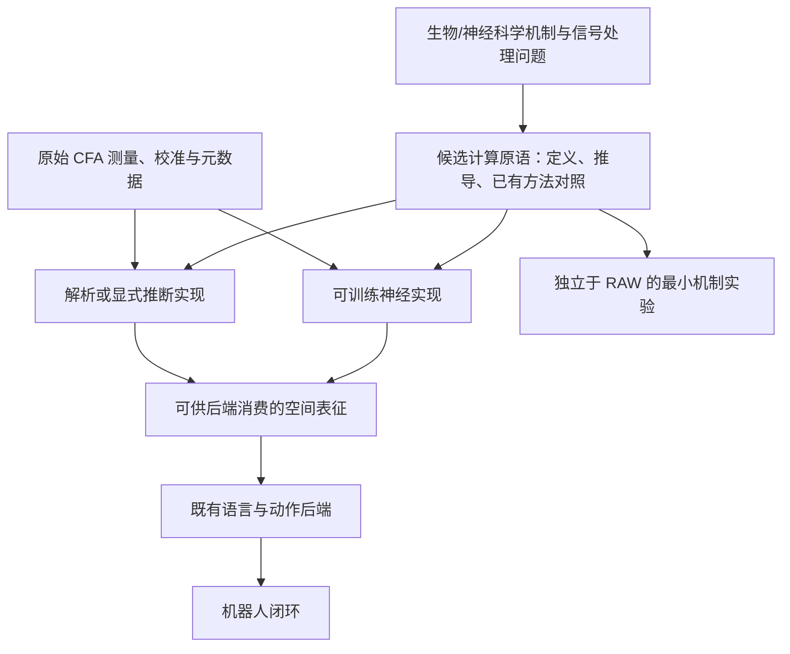

# OWAC 研究路线与 RSS 2027 投稿计划

**版本：v3，2026 年 10 月 8 日。研究目标提升为：从神经科学、生物学及信号处理原理中提炼新的、可复用的计算原语，以 RAW 原生编码和机器人闭环作为首个验证场景。** 神经网络版本同样可以受到生物启发；神经实现与非神经实现是实现选择，不决定思想来源或创新等级。

本项目以 ResNet 的残差学习、Transformer 中的 attention 所体现的“简洁规则、可组合结构、广泛适用性”为长期参照。目标是原语层面的原创研究；是否达到这一影响力只能由研究结果与后续应用判断，不能在立项时预先宣布。

保留的技术边界：主方法不做 RAW→RGB/sRGB/XYZ 转换，不保留原 RGB 图像塔作为编码主体；输出特征、token 或其他可消费表征，接入现有 VLM/VLA 的语言与动作后端。已知资源为机械臂、轮式人形机器人、充足 GPU、约十人团队，相机待定。以下均为候选路线与验证计划，尚无 OWAC 实验结果或已成立的新原语。

本版将旧方案中的“噪声感知多尺度编码”和“解析视网膜前端”保留为起点及对照，不把其中任一模块组合预设为最终创新。工作题目暂定为 *OWAC: Biologically Inspired Computation from Sensor Measurements to Action*，待核心规则确定后围绕真正贡献命名。

## 1. 创新层级、研究结构与方法边界

新的核心问题是：

> 能否提出一种明确的信号交互与表征更新规则，使局部测量、上下文和可靠性以新的方式参与计算；该规则既能组合成 RAW 编码器，也具有超出特定相机或任务的研究价值？

需要把三个层级分开设计：

| 层级 | 应交付什么 | 主要证据 |
| --- | --- | --- |
| 计算原语 | 简明的输入/状态定义、交互规则与输出；说清改变了哪一步计算 | 与最接近已有算子的关系、性质分析、最小反例和受控实验 |
| 编码架构 | 用这个原语构建可训练或解析的 RAW encoder | 信息保留、训练稳定性、复杂度、精度与吞吐 |
| 机器人系统 | 接入现有 VLM/VLA，完成语言条件控制 | 真实 RAW 下的闭环成功率、失败边界、跨照明与跨相机验证 |

RAW 为研究提供了明确的物理测量、噪声与饱和问题，是发现和检验原语的具体场景。低光/HDR 改善是重要结果，但不能独自证明一种计算方式具有通用价值。

**生物启发与实现方式是两个独立维度。** 树突分支、反馈预测、侧向抑制、群体编码和适应性动力学，都可以导出可训练网络，也可以导出固定算子或显式推断。神经版本可以正常使用反向传播；首轮不强求同时发明训练算法、神经硬件和编码原语。



两个实现不必都进入最终论文；同一思想能有多种实现，有助于区分规则本身和学习容量的作用。严格非神经编码保留为可选路线，不再被默认列为更有原创性的主路线。

| 项目 | 本版约束 |
| --- | --- |
| RAW→RGB / sRGB / XYZ | 主方法训练与推理均不生成此类图像作为下游输入；不以先去马赛克再改名绕过约束 |
| 测量校准 | 允许黑电平、增益/响应校准、坏点掩码、CFA 重排、噪声估计和数值变换；逐项披露 |
| 原视觉编码器 | 主方法重新设计 RAW 编码器，移除原 RGB 图像塔；后者保留于外部强基线 |
| 教师与重建 | 主方法不采用 RGB 教师蒸馏或 RGB 重建；可以研究 RAW/潜在测量预测 |
| 继承的预训练 | 可以使用既有语言与动作后端，披露其原始 RGB 预训练来源 |
| RGB 外部用途 | 允许独立基线、人工预览和标注；不流入主方法编码路径 |
| 架构自由度 | 允许神经、生物启发神经、解析、显式推断及混合实现；准确标注每部分 |
| attention / 残差 | 不要求整个系统禁用已有运算；必须隔离并验证新原语的贡献，不能靠移除某个模块定义创新 |
| “非神经”的范围 | 仅指符合该定义的 RAW 编码器，后端仍可能是神经网络 |

## 2. 文献定位：什么已经有人做，什么需要我们证明

“使用 RAW”“跳过固定 ISP”“使用相机元数据”“将 RAW 转为 token”均不能单独支撑首创。需要围绕编码机制及其闭环效果建立贡献。

| 一手工作 | 对本项目的直接意义 |
| --- | --- |
| [ISP-less Low-Power Computer Vision，2022](https://arxiv.org/abs/2210.05451) | 不经过常规 ISP 的 RAW 视觉已有研究，不能将旁路 ISP 本身作为贡献 |
| [RAW-Adapter，ECCV 2024](https://arxiv.org/abs/2408.14802) | 输入级可学习 ISP 与模型级适配已有先例；本版应超出前置 adapter |
| [AODRaw，CVPR 2025](https://openaccess.thecvf.com/content/CVPR2025/html/Li_Towards_RAW_Object_Detection_in_Diverse_Conditions_CVPR_2025_paper.html) | 真实 RAW 检测与 RGB 教师辅助预训练已有基础；本版不沿用教师蒸馏作为核心 |
| [Raw-VLM 作者仓库](https://github.com/kepengxu/PRISM-VL)、[PRISM-VL，2026](https://arxiv.org/abs/2605.11727) | 已研究 RAW 相关表征、tokenization、相机条件化与视觉语言理解；不能声称首次 RAW 接入 VLM |
| [RawVLA，2026](https://arxiv.org/abs/2609.37530) | 动作监督的流式神经 ISP、冻结 VLA 以及真实机器人实验构成首要直接基线 |
| [RAWild 作者仓库](https://github.com/I2WM/RAWild) | 跨传感器 RAW 感知已有工作；泛化必须用真实留出相机验证 |

RawVLA 的神经 ISP 仍输出供 VLA 使用的图像，而本版 OWAC 直接输出非图像表征并替换原图像塔。这是明确的方法边界，但不等于已证明新颖性或优势。RawVLA 的实机已经使用 12-bit Bayer 相机，且其方法输入包含去马赛克后的线性测量；因此“真实 RAW 实机”不是 OWAC 的首创，复用数据前也要检查是否仍保有原始 CFA。其神经 ISP 输出不应被人为限制为 uint8。[RawVLA 原文](https://arxiv.org/html/2609.37530v1)

本轮检索支持继续研究下列组合，但不构成“首次”的证明：

1. 在原始 CFA 采样上，设计与噪声、空间尺度和动作定位需求共同相关的编码机制。
2. 使这种表征接入既有语言—动作后端，并验证替换图像塔后的能力恢复路径。
3. 在强成像基线、普通 RAW 网络和简单测量投影对照下，解释闭环收益来自哪里。
4. 若非神经网络路线成立，明确其计算、样本效率和失效边界，而非仅强调没有反向传播。

### 生物视觉与数学工具能提供的启发

| 基础工作 | 可以借鉴的原则 | 不能直接推导的结论 |
| --- | --- | --- |
| [Atick 与 Redlich，1992](https://redwood.berkeley.edu/wp-content/uploads/2018/08/Atick-Redlich-NC92.pdf) | 编码应在冗余压缩与噪声抑制之间权衡，滤波策略与信噪比相关 | 中心—周边滤波一定优于学习模型，或暗光下应无限放大高频 |
| [Olshausen 与 Field，1997](https://www.rctn.org/bruno/papers/VR.pdf) | 稀疏表示可形成局部、方向性结构编码 | 稀疏系数天然具备语言语义，或最优化求解一定适合实时控制 |
| [Mallat，Group Invariant Scattering](https://arxiv.org/abs/1101.2286) | 固定多尺度小波与非线性算子能构造具有特定稳定性的描述符 | 全局平移不变性适合机器人定位，或稳定性理论直接保证操作成功 |
| [Mäkitalo 与 Foi，2013](https://researchportal.tuni.fi/en/publications/optimal-inversion-of-the-generalized-anscombe-transformation-for-/) | Poisson–Gaussian 噪声需要显式处理，方差稳定化有适用条件 | 一次 log 或 Anscombe 变换就能消除低光噪声 |

这些是两类实现共同的设计依据，不是 OWAC 的实验证据，也不限于解析前端。生物机制可以约束可训练网络的连接、状态、非线性和动态更新；不必将神经网络简单等同于现有 CNN 或 Transformer。脉冲神经网络仍是神经网络；“生物启发”也不等于已经证明生物系统采用相同算法。

### 原语层面必须补齐的相关工作

| 原始研究 | 已有计算思想 | OWAC 必须越过的边界 |
| --- | --- | --- |
| [Deep Residual Learning，2015/2016](https://arxiv.org/abs/1512.03385) | 残差参数化和深层网络训练 | 参照其可复用规则，不把堆叠模块数当原创性 |
| [Attention Is All You Need，2017](https://arxiv.org/abs/1706.03762) | 以 attention 构建序列变换架构 | Transformer 不是 attention 思想的起点；比较具体计算机制 |
| [Rao 与 Ballard，1999](https://doi.org/10.1038/4580) | 高层预测、低层预测误差与循环推断 | “预测—误差—反馈”本身已有先例 |
| [Sacramento 等，2018](https://arxiv.org/abs/1810.11393) | 多隔室树突电路与局部误差驱动学习 | 给单元增加树突分支或局部误差，不自动形成新原语 |
| [Chavlis 与 Poirazi，2025](https://www.nature.com/articles/s41467-025-56297-9) | 受树突启发的结构化连接与受限输入采样 | 已有可训练的树突 ANN，不能声称首次以神经科学设计网络 |
| [Hénaff 等，2020](https://pubmed.ncbi.nlm.nih.gov/32427825/) | 用群体活动的不同统计量表征特征与不确定性 | 内容与可靠性共同编码已有实验和模型基础 |
| [Slot Attention，2020](https://arxiv.org/abs/2006.15055) | 多轮竞争分配与对象表征 | 竞争、迭代、多个槽位均不能单独作为区别 |
| [Sinkformers，2021/2022](https://arxiv.org/abs/2110.11773) | 用双随机归一化改变 attention 的交互 | 仅把 softmax 换为 Sinkhorn 或增加容量约束不是新思想 |
| [Belief Propagation Neural Networks，2020](https://arxiv.org/abs/2007.00295) | 可学习的消息传递，继承 BP 的部分结构与性质 | 避免重复计算证据已有工作，必须与 BP/BPNN 直接比较 |
| [Growing Neural Cellular Automata，2020](https://distill.pub/2020/growing-ca/) | 可微局部更新产生自组织动态 | 局部规则、迭代和仿生自组织已有模型 |
| [Mamba，2023](https://arxiv.org/abs/2312.00752) | 输入相关的状态空间更新 | 可选择的状态记忆和线性序列计算已有强基线 |
| [Muzellec 等，2025](https://arxiv.org/abs/2502.21077) | 复值表示与 Kuramoto 同步用于视觉分组 | 相位同步和振荡绑定也不能直接视为新颖点 |

检索结论是：这些机制有值得探索的计算含义，同时已有密集先例。当前尚未证明某个 OWAC 候选具有首创性。每个候选需交付“最近工作的精确规则—本候选的规则—可检验差异”三栏对照，不能以没有检索到同名方法代替新颖性分析。

## 3. RAW 优势的物理表述

建议将动机写成：“常规成像处理可能弱化机器人所需的测量证据；直接利用传感器观测有望改善部分低照度和高反差任务。”需要区分以下概念：

- 10、12、14 bit 是采样或编码精度。有效动态范围由饱和上限、噪声底和采集模式共同决定，不能仅由文件位深判断。EMVA 1288 用饱和与最低可检测信号定义动态范围。[EMVA 官方资料](https://www.emva.org/standards-technology/emva-1288/emva-standard-1288-downloads-2/)

- RGB 不必是 8 bit；线性 RGB、浮点 RGB 和显示用 sRGB 是不同接口。Bayer RAW 也不是每个像素均有完整三色测量。

- ISP 中的裁剪、降噪、局部色调映射与量化可能丢失任务线索；合理的去马赛克、校准和降噪也可能帮助模型。不能预设去掉全部 ISP 一定更好。

- 少光子导致的低信噪比、传感器已饱和的区域，不能仅靠 RAW 输入恢复。长曝光、多帧融合或主动照明带来额外信息，必须作为独立实验变量。

- RAW 是接近传感器的数字读数，通常已包含传感器内部处理，不能简单等同于未经任何处理的物理光子计数。

Tesla 可作为工程动机参考，原始材料入口是 [Tesla AI Day 2021 官方视频](https://www.youtube.com/watch?v=j0z4FweCy4M)。本次可访问的一手页面不足以核实“完全绕过哪些 ISP 环节、在何版 HydraNet 上得到多少收益”的具体说法；首稿不使用未经核实的工程细节或定量提升作为论据。

## 4. 原语研究的假设与验收标准

**H1：一种明确的状态和交互规则，可以提供可测量的归纳偏置或计算优势。** 首先在可解释的小问题上，比较相同信息、相近参数/算力与训练预算的已有算子，证明收益来自该规则。不能仅因写法不同就宣称突破，也不要求证明神经网络无法模拟它。

**H2：这一规则的优势可以转移到真实 RAW 编码。** 在相同采集条件下保留任务信息、恢复语言条件能力，并优于相应的普通 RAW 网络或解析基线。若机制试验成立但真实 RAW 无收益，需要收窄适用条件。

**H3：编码优势能转化为机器人闭环收益。** 相对于充分调优的 RGB、浮点图像和神经 ISP，在困难照明、未知相机或样本效率上获得可重复改善，同时报告正常光性能和完整系统成本。

通用性属于渐进证据：最低要求是在两个具有不同统计结构的信号问题上复用同一核心规则，而非为每项任务另写一个算子。首轮可用 RAW 和可控的一维异方差信号/测量集合，不必立即采购新传感器。更广泛的模态、规模与任务验证属于后续长期工作；两个小任务也不足以证明达到 ResNet/Transformer 的普适性。

原语候选必须能够回答：

1. **计算对象是什么？** 普通向量、带可靠性的状态、分支响应、测量集合还是动态场？
2. **基本交互是什么？** 哪一步决定信息如何组合、竞争、保留或更新？
3. **与已有方法究竟差在哪里？** 能否化简成标准 attention、门控、卷积、BP、状态空间更新或它们的直接组合？
4. **代价与性质是什么？** 参数、内存、实际时延、训练稳定性、对噪声/排列/分辨率的响应。
5. **如何推翻候选？** 哪个消融、反例或强基线结果会表明新规则没有独立价值？

若候选最终可精确改写为现有规则，应按已有方法的应用或改进定位；若确有不同约束和计算结构，则继续检验其作用。可表示性、代数等价性和实际计算效率是不同问题，不能混为“谁绝对无法表达谁”。

## 5. 计算原语探索与生物启发的神经实现

### 5.1 三个候选方向，而非预先锁死一种网络

| 方向 | 生物/计算启发 | 真正需要定义的计算变化 | 首个机制实验 | 最近已有方法 |
| --- | --- | --- | --- | --- |
| P1：分隔测量证据与上下文的交互 | 树突隔室、群体可靠性编码、局部竞争 | 信息不仅携带内容，还携带来源/可靠性；定义上下文如何改变解释及分配，同时区别实测支持 | 重复/相关观测、矛盾线索、低信噪比下的局部定位 | 树突 ANN、BP/BPNN、Slot Attention、不确定性建模 |
| P2：根据预测误差演化的计算 | 反馈预测、适应与局部抑制 | 定义误差如何改变局部更新规则和计算分配，而非仅多迭代几层 | 突变曝光、局部遮挡、输入长度和迭代预算变化 | 预测编码、循环网络、动态计算、SSM |
| P3：以关系状态组织表征 | 同步、相位关系、分布式自组织 | 定义关系如何绑定/拆分局部信号，避免早期混合丢失多个目标 | 重叠轮廓、多目标分组、扰动下结构恢复 | 复值/Kuramoto 网络、NCA、图消息传递 |

三者均为研究种子，不是已成立的新方法。首轮建议优先 P1：它与 RAW 的真实噪声、相关采样、局部细节及机器人错误最直接相关，也能设计清楚的反例。P2/P3 做小规模公式和文献筛查；不同时开展三套大型 VLA 训练，更不把所有生物机制堆成一套网络。

### 5.2 P1 的最小定义草案

暂称“证据交互算子”，只是工作描述，不作为首创名称。普通 block 常以一组向量为输入输出；本候选尝试维护有不同角色的状态：

```text
S_i = (v_i, u_i, c_i, p_i)

v_i: 从真实测量构造的局部内容/候选结构
u_i: 测量噪声、有效性及其传播摘要
c_i: 来自邻域/更高层的上下文或解释假设
p_i: 对应的测量支持范围、来源和相关性摘要
```

其中，传感器噪声和后端任务不确定性必须分开定义。不能将任意神经特征的幅值称为物理精度，也不能把一个 sigmoid 输出直接命名为可信概率。u 的校准与传播需要单独验证。

候选的一次计算包含三个职责：

1. **分支分析。** 局部实测证据与上下文分别进入受约束的分支，再在明确的位置交互。神经版本允许学习局部变换、分支非线性和耦合参数；解析版本使用固定统计规则。这是受多隔室计算启发的工程抽象，不是树突生理的直接复制。
2. **交互与分配。** 上下文改变哪些结构解释值得保留、哪些采样需要共同分析；对于同一来源的重用，保留可追踪的相关关系。可以复用一个观测为多个假设服务，不将其误当成多个独立观测。冲突不应无条件平均为一个虚假的确定状态。
3. **联合读出。** 输出内容和上下文推断结果，同时保留测量支持及有效性信息，供下层原语或 VLA 使用。是否保留多假设、如何压缩它们，是具体设计变量，需与单向量读出比较。

用符号表示这一研究对象：

```text
E = Init(r, CFA, calibration)                 # 实测证据及来源
C⁰ = InitContext(E)                         # 解释状态
(Eᵏ⁺¹, Cᵏ⁺¹) = Uθ(Eᵏ, Cᵏ; support)        # 待发现的交互规则
Z = Readout(Eᴷ, Cᴷ, positions, validity)     # 非图像表征
```

**这组状态和符号只定义研究空间，不是已完成的算法。核心 Uθ 尚需推导。** 要交付的第一件研究成果是 Uθ 的具体方程、最小实现和最近方法对照，不能用这个抽象框图代替方法章节。

一个必须警惕的退化例子是“按方差倒数加权”：对同一标量的独立、无偏、Gaussian 测量，权重正比于逆方差的均值已是标准估计。将它加上 MLP 或 softmax，不足以证明新原语。BP/BPNN 也已处理消息中的证据重用。因此，本候选需要真正解决的是：**在有限状态与实际计算预算下，能否构造一种可组合的非线性交互规则，使测量支持、相关性与解释假设在压缩后仍具有可验证的作用？** 如果现有方法已经实现相同规则和性质，就停止把它作为首创候选。

### 5.3 从原语到完整 RAW 编码器

只有最小规则通过机制实验后，再据此构造编码器：

```text
RAW CFA 采样
  → 校准与保留测量身份的输入展开
  → 由同一新原语组成的局部/多尺度计算
  → 明确定义的空间读出
  → 既有 VLM/VLA 的语言与动作后端
```

不能仅在原有大型 Transformer 前加一个仿生滤波器，然后将整个系统称为新信号处理范式。需要说明新原语承担了哪些主要计算，以及删除/替换它后发生了什么；必要的残差连接、线性投影和优化器可以继续使用。

以下是 RAW 场景中的必要设计检查，而非独立创新声明：

- CFA 相邻异色采样不直接视为同一通道边缘；保留真实采样位置与类型。
- 保留低频/DC、符号、方向和位置，避免只留下全局纹理或对比。
- 可靠性与尺度选择需要考虑汇聚降噪和精细定位的取舍。
- 维持基本空间覆盖，防止亮区主导而暗区目标完全丢失。
- 单帧迭代次数 K 与物理历史帧数 T 分开。更多计算不等于获得更多光子或新观测。
- 最终读出可为 token、特征场或结构集合，不要求中间各层都仿照视觉 Transformer token。

### 5.4 神经与非神经版本如何共同验证

神经版本可以学习分支变换、交互系数和读出，也可以采用可微的显式状态更新。明确哪些结构来自假设、哪些由数据学习。可使用标准反向传播训练，重点先放在前向计算原语。

非神经版本保留同一状态含义，使用固定分析与显式推断。它用于检查“规则是否有效”与“学习容量是否必要”；如果无法保留相同机制，不强行制造一个形式上的非神经对照。

训练继续采用 RAW 域自监督、RAW—语言/目标对齐、动作学习三个阶段。主方法不设 RGB 教师或 RGB 重建。神经版本可联合学习新编码器与部分后端；解析版本固定编码器，训练后端。是否需要每个阶段由学习曲线判断，不预设冻结 VLA 即可使用新表征。

初期优先固定步数与固定状态大小，检查稳定性和实际吞吐；自适应停止、异步计算、复杂稀疏路由与专用硬件均在规则有效之后再考虑。

## 6. 解析实现与可解释的起点

以下 B1/B2 沿用 v2 的可执行设计，作为机制探针、解析对照和未来原语的实现素材。它们本身由已有工具组成，当前不被列为原语级原创成果，也不比生物启发的神经实现具有更高优先级。

### B1：固定的解析测量编码

这一分支使用固定滤波、显式统计估计和确定性规则。所有传感器到描述符的运算均可写出，不训练卷积、attention 或神经 MLP。

**步骤一：保留真实测量与噪声模型。**

对采样位置 i、滤色片类别 c，记录原始读数 y、黑电平 b、白电平 w，采用固定校准尺度：

```text
r_i = (y_i - b_c) / (w_c - b_c)
Var(r_i | μ_i, gain, exposure) ≈ α_c · μ_i + β_c
```

α、β 应由对应增益/曝光设置的实测数据拟合；μ 是未知无噪均值，其局部估计只是近似。读出相关噪声明显时，使用相应协方差模型，不能默认所有采样独立。保留黑电平附近的有符号残差；对饱和、坏点及缺失值单独标记，不将饱和信号当作高置信度观测。

**步骤二：中心—周边与方向结构分析。**

在同类 CFA 采样点及其实际坐标上构造局部核，计算多尺度低通、中心—周边差分与方向性响应。首先分别分析各 CFA 子格；跨类型组合使用经过校准的区域描述符，不插值出缺失的逐像素 RGB 值。

对线性滤波核 a：

```text
d = aᵀr
σ_d² = aᵀΣa
z = d / sqrt(σ_d² + ε)
ON = max(z, 0), OFF = max(-z, 0)
```

z 是噪声归一化响应，不是恢复后的图像，也不是经证明的任务置信度。ε、增益上限和噪声模型需要标定/验证，避免暗区数值放大。尺度选择可依据可预测的输出噪声和局部结构采用确定性规则，并与固定尺度对照。

保留有符号方向响应或复小波的相位信息，使精细位置能够被下游辨认；不能仅输出丢失位置与符号的全局散射能量。CFA 色彩通道与生物视锥并不等价，不能直接照搬生理参数。

**步骤三：并行保留低频与绝对测量。**

仅保留对比度会丢掉亮度、缓变表面和部分颜色线索。因此，每个区域还输出按 CFA 类型统计的低频/DC、曝光/增益、饱和比例和噪声摘要。它们是测量描述符，不是三通道成像结果。对“红色杯子”等任务，必须专门检验这些统计是否足以支持颜色与语言条件，而不能只做灰度几何任务。

**步骤四：确定性打包为空间描述符。**

每个 token 包括：

```text
t_j = [
  多尺度有符号响应与方向/相位特征,
  分 CFA 的低频测量,
  噪声/饱和/有效性描述,
  位置、尺度、相机与时间信息
]
```

先固定规则网格输出，再尝试“均匀覆盖 + 有限自适应细节配额”。若做噪声阈值收缩，保留一条低维、未阈值化的测量摘要，检查微弱任务线索是否被删掉。不能把“弱信号”自动等同于“无用信息”。

这些 token 不一定包含物体类别，也不保证是动作的充分统计量；后端需要学习如何从它们推理和控制。所有压缩都会有损失，应该测量具体保留和舍弃了什么。

### B2：可选的显式稀疏推断

若 B1 已能跑通，可探索以固定解析字典表示 RAW patch：

```text
c* = argmin_c (r - Φc)ᵀΣ⁻¹(r - Φc) + λ ||c||₁
```

Φ 的原子定义在实际 CFA 测量空间，不以 RGB 重建为优化目标。输出稀疏系数、空间索引和残差统计。使用显式最优化求解；若改为可训练展开网络，就应归到路线 A。

固定字典与数据驱动字典需分开报告；后者可以是传统统计学习，但不能声称完全不学习。逐 patch 迭代求解可能比小网络慢，因此 B2 是探索项，不与 B1 同时作为首轮主线。

### 非神经网络边界的验收

| 实现 | 如何表述 |
| --- | --- |
| 固定滤波、解析归一化、显式最优化、确定性打包 | 非神经 RAW 编码器 |
| 数据统计得到的 PCA、白化或字典 | 统计学习编码器，说明拟合数据与方法 |
| 固定维度映射、补零或固定线性嵌入 | 可以保留严格非神经编码边界 |
| 可训练线性投影 | 明确披露学习参数；最严格版本采用固定映射作对照 |
| 神经 MLP、可训练跨注意力 resampler | 神经适配模块，计入模型与算力；不能藏在“接口”名称下 |
| SNN、可训练滤波器、可训练迭代展开 | 神经网络路线 |
| 原有 VLM/VLA 的语言和动作模型 | 允许保留，但整套系统仍包含神经网络 |

首个严格版本采用固定描述符、固定嵌入映射，训练后端去适应这种输入。另设学习投影版本衡量接口训练的重要性。不能把大部分 RAW 视觉处理搬到一个庞大的“connector”中，然后宣称非神经编码器完成了全部工作。

## 7. 与现有 VLM/VLA 的接口及语义恢复

建议选团队最熟悉的 [openpi 检查点](https://github.com/Physical-Intelligence/openpi) 作为主后端，以 [OpenVLA-OFT](https://openvla-oft.github.io/) 作为第二后端验证。锁定代码版本、权重和预训练来源，不从零训练完整 VLA。

openpi 的公开实现中，`embed_prefix` 将图像塔输出与语言 token 组成前缀，因此存在替换视觉入口的工程位置；训练和推理入口还会执行观测预处理，必须一并改成 RAW/特征路径。只换图像塔、继续走 RGB 图像处理器是不完整的实现。[openpi 的 pi0.py](https://github.com/Physical-Intelligence/openpi/blob/main/src/openpi/models/pi0.py)

统一接口至少包含：

```text
features:    [batch, n_tokens, descriptor_dim]
positions:   每个 token 的实际图像坐标与支持尺度
camera_time: 相机标识、时间戳或时间差
validity:    token 与底层观测的有效性掩码
uncertainty: 明确定义的测量噪声/饱和摘要
```

接口层负责维度、序列顺序、位置编码和 attention mask。可靠性信息如何进入后端必须实现为可消费的字段或特征；不能仅把它保存在日志里。原有序列位置编码不自动等价于二维几何位置，多视角和时序索引也不能混淆。

最大的代价是：**移除原图像塔，也移除了它的大量视觉语义预训练能力。** 继承语言模型和动作头不会自动补回这一缺口。不能预计仅凭 100—200 条动作示范就恢复开放词汇视觉理解。

建议分三阶段诊断：

1. **表征是否保留信息。** 用简单探针评估位置、边缘偏移、颜色/材质区分、语言目标选择；探针结果是诊断，不能替代闭环。
2. **后端能否使用信息。** 先做有限物体和指令的 RAW—语言对齐，检查相似物体、未见布局和同物不同照明。神经实现可同时学习编码器；严格解析实现固定编码器，训练后端参数。
3. **是否支持动作。** 从两个任务的正常光照开始，确认语言选择与动作控制正确，再引入低光和高反差。逐步扩大后端可训练容量，比较冻结、LoRA 和部分解冻；冻结失败不能单独证明编码器失败。

主张应与数据相称：若只能完成有限任务中的语言条件控制，就报告这一能力，不能外推为通用 RAW VLM。若路线 B 只有在更大后端或更多训练数据下有效，这也是必须披露的代价。

## 8. 数据、数值精度与采集设计

采用“真实 RAW 视觉数据用于启动，自采 RAW—语言—动作数据用于主要结论”的组合。公开数据必须逐项审计 CFA、黑白电平、位深、曝光和处理历史。

- [SID](https://github.com/cchen156/Learning-to-See-in-the-Dark)、[AODRaw](https://github.com/lzyhha/AODRaw) 可支持成像噪声、检测与表征预热，但不代替动作示范。
- PRISM-VL 与 RawVLA 资源可用于关联任务及外部对照；派生 XYZ 或去马赛克数据不能冒充本版的原始 CFA 输入。若没有原始采样，不能靠重新马赛克声称恢复了真 RAW。
- 现有 RGB 数据可以说明继承后端的训练来源；本版不把逆处理 sRGB 作为主要 RAW 证据。若使用合成测量，优先从线性 HDR 渲染缓冲区出发，模拟 CFA 和实测噪声，单列为合成数据。
- 人工可以借助独立 RGB 预览完成文字、目标或动作标注；主训练输入仍为 RAW 及其非图像描述符，不由 RGB 教师生成中间特征。

先采 2 项任务、100—200 条示范用于连通性和低数据试验，不将此视为语义学习已经足够。随后扩展 4—6 项任务，每项约 150—250 条起步，并同时积累更多没有动作标注的 RAW 场景及语言/目标标注。根据学习曲线决定是否增加数据；GPU 充足不能替代训练分布覆盖。

同一 RAW 分别派生强 ISP、浮点图像和神经 ISP 对照；厂商同步 RGB 与软件 ISP 来源要区分。离线样本可以同帧配对，闭环不同策略会改变后续观测，因此只能匹配初始场景、采集规则和任务条件，不能声称全轨迹同帧。

按物体实例、场景、采集会话、照明和传感器拆分训练/验证/测试，防止相邻帧泄漏。第二种相机作为真正的硬件留出，分别报告零样本与少量适配结果。

原始数据保留无损整数采样；校准、早期滤波和方差计算优先 FP32，后续特征再进入 BF16。排查 PIL、JPEG、uint8、视频编码、resize 和图像归一化的隐式处理。BF16 的指数范围不代表原样保留全部 RAW 灰阶；数值精度需单独验证。

时序暂不作为首版必要条件。之后可加入曝光补偿后的因果差分或解析时序状态，但普通 RAW 帧不会因此成为事件相机，也不会自动获得事件传感器的时间分辨率。所有基线须获得相同历史帧数、曝光预算与时延约束。

## 9. 能区分路线优劣的实验协议

### 先做原语机制实验，再做系统比较

机制层面选择与候选最接近的已有方法，而非只比较普通 CNN。P1 至少纳入普通 attention/门控、Slot Attention、显式推断或 BP/BPNN 的适用版本；若采用运输式归一化，纳入 Sinkformers。P2/P3 分别增加相应循环/SSM 或同步/NCA 对照。不同算法的适用域要写清，不强迫缺少相应输入模型的方法直接运行。

建议首轮建立以下受控任务，使用已知生成过程和真实目标：

| 机制实验 | 需要观察什么 | 防止错误解释 |
| --- | --- | --- |
| 同一观测的重复输入 | 测量支持/置信估计是否随复制产生虚假提升 | 保持来源身份；新独立曝光确实增加信息，必须另测 |
| 可控相关噪声与冲突测量 | 合并后估计、误差和覆盖率是否合理 | 对照获得同样的元数据，不能仅给新方法噪声真值 |
| 无新增观测的迭代 | 数值稳定、解释变化、耗时及测量证据是否被重复累计 | 更充分推断可改善任务置信度；不能要求所有置信度永久不变 |
| 局部细节与强背景干扰 | 是否在噪声下保留目标位置、多个候选或弱线索 | 同等输入分辨率和空间覆盖，避免偷换信息量 |
| 一维信号或一般测量集合 | 相同核心规则能否复用 | 只改变输入/输出适配，不为新任务重写更新规则 |

小规模实验可用精确来源集合或完整相关结构作参考；扩展时若用近似摘要，量化其误差和成本。不能在没有证明的情况下声称任意循环图都能精确去重、保证收敛或达到线性复杂度。

统计量按任务选择：估计误差、定位误差、置信区间覆盖率；确有概率输出时再报告适当评分规则。学习到的任意 score 不自动具备概率语义。机制结果用于筛查原语，不代替下述机器人试验。

### 系统对照组

| 方法 | 设置与用途 |
| --- | --- |
| C0：充分调优的 RGB VLA | 同源 ISP、合理增强和足够后端适配，避免只打败默认配置 |
| C1：浮点线性图像 / XYZ | 独立图像接口基线，检查保留精度和线性信息是否已足够 |
| C2：RawVLA / 动作监督神经 ISP | 允许浮点输出；报告原论文式冻结配置与可比后端适配配置 |
| C3：普通 RAW CNN/ViT | 同样替换原图像塔，匹配 token 和训练数据，隔离新架构贡献 |
| C4：RAW patch 固定投影 | 简单打包、固定线性映射、同一后端；检验复杂编码是否必要 |
| A：候选原语的神经编码器 | 新交互规则承担主要编码计算，与其直接替代 block 比较 |
| B：解析/显式推断编码器 | B1 作为起点；若实现候选原语，和普通固定前端分开报告 |

C0—C2 可以使用原视觉塔，这是合理而强的系统对照。C3、C4 与 A、B 共享替换后的后端和适配协议，是机制归因的关键对照。既报告任务匹配的强系统比较，也报告 token、后端可训练容量、更新次数和总计算受控的比较；不能用一个参数数值声称所有系统已完全公平。

先对所有组做离线与小规模闭环筛选，首轮选择最有解释力的组进入主实验；不得因为某强基线表现好而将其删除。所有筛选依据来自预先划定的验证集。

### 任务与指标

机械臂主任务覆盖暗色目标抓取、逆光下语言指定目标选择、依赖精确边缘/插槽位置的放置、明暗变化中的连续取放。加入颜色、类别和位置干扰项；精密接触任务仅在底层控制已稳定时使用，避免控制失败掩盖视觉问题。

光照包含正常光、两档低光、同画面高反差、动态明暗变化。记录照度、亮暗区域亮度比、曝光/增益、饱和比例和噪声；lux 单独不能定义 HDR。曝光自适应属于另一因素，先固定或使用相同曝光规则。

主指标是闭环成功率、最差条件表现、碰撞/误抓/失去目标等失败类型。辅助报告定位误差、语言目标选择、动作耗时和训练数据需求。B 尤其要报告 CPU/GPU 实际运行时间、内存、端到端 p50/p95 时延；减少可训练参数并不自动减少运算。能耗如需宣称必须实测完整系统。

每个单元先做约 10 次探索，最终至少以 30 次作为预算起点、分布于至少 3 个训练种子，并报告种子差异和置信区间；这不保证发现小幅优势。以 4 任务 × 5 条件 × 4 个最终主比较组 × 30 次为例，共 2400 次闭环试验，30 次为跨种子的总数。若 7 组全部进入该规模则为 4200 次，额外消融另计。最终样本量根据先导方差和目标效应决定。

匹配初始布局、随机化方法运行顺序、记录重置误差。不得把视频帧当作独立试验，也不能用 PSNR/SSIM 或 VQA 成绩代替机器人结果。

### 优先消融

先做原语消融：用最近的已有规则替换 Uθ；保持状态维度、输入字段、训练和计算预算可比；分别删除分支隔离、来源/相关性信息或所提出的独特交互。若候选的特殊部分没有作用，就不把其它工程提升归功于新原语。

随后做 RAW 与接口消融：

1. 噪声感知尺度选择 vs 固定尺度；真实校准 vs 简化/错误噪声估计。
2. 保留/移除分 CFA 低频测量；保留/移除符号、相位与空间位置。
3. 均匀空间覆盖 vs 自适应配额，在相同 token 预算下比较；检查暗区目标是否被遗漏。
4. B 的固定接口 vs 学习投影；后端冻结、LoRA 与部分解冻分别报告。
5. C3/C4 vs A/B，排除仅由后端容量、数据量和 token 数带来的提升。
6. 原生位深与同一 RAW 再量化；处理后 RGB 量化另列，不与 ADC 位深混淆。
7. 同传感器与留出传感器；无元数据、真实元数据及打乱元数据诊断。
8. 单帧与因果短序列，等曝光与等历史长度比较。

关键失效诊断：若 B 的简单探针保留了任务信息但 VLA 学不会，优先检查接口与语义对齐；若探针也丢失了颜色或精细位置，优先改编码。若固定 RAW 投影已经同样好，说明复杂编码尚未建立必要性。

轮式人形机器人后续验证跨明暗区域到达目标并取物、逆光下语言指定目标取放。所有方法共享成熟导航和底层控制，平台保留自己的动作接口。区分视觉迁移与本体动作适配，不预设跨本体零样本控制。

## 10. 相机选型与验收

相机选择先满足连续机器人采集，再比较像素数。建议主平台采用同型号外部相机与腕部相机，后续引入第二类传感器做留出测试。以下为工程验收目标，不是已验证的产品规格或采购承诺。

| 项目 | 验收内容 |
| --- | --- |
| 原始输出 | 优先真实 RAW12 或更高；连续 Bayer 输出，而非 RGB 包装成 16-bit |
| 控制能力 | 可固定曝光、模拟/数字增益，关闭自动白平衡、自动曝光及非必要处理 |
| 元数据 | 每帧曝光、增益、时间戳、CFA 与有效位数；黑电平和白电平可标定 |
| 时序 | 目标至少 30 FPS 连续稳定采集；多相机硬件同步或可测量的时间对齐 |
| 动态性能 | 实测读取噪声、线性区、饱和阈值与暗区 SNR；运动场景优先评估全局快门 |
| 镜头与场景 | 在实际工作距离比较视场、光圈、景深、暗角和边缘清晰度 |
| 系统链路 | 驱动、带宽、丢帧、时间抖动、机械安装、散热与线缆都要验收 |

全局快门和低照度能力存在具体器件取舍，不能仅按标签选择。若相机有 HDR/WDR 模式，查清它输出单曝光、分曝光 RAW，还是已经融合/压缩的流；HDR 模式单独标注与控制。

到货后用暗场、均匀光场、曝光扫描和运动靶检查真实位深、黑电平、坏点、噪声、裁剪与时间同步。优先借测或小批验收两款候选，再确定批量型号。

存储使用保留原始值的无损数组/容器，RGB 预览可另存视频。例如 3 路 640×480、uint16、30 FPS 的未压缩有效载荷约 55.3 MB/s，即 199 GB/小时，尚未计元数据、索引和备份；不能用普通有损视频替代主 RAW 数据。

## 11. 路线收敛、新颖性检查与风险

首轮以“发现可复用规则”为主线组织团队。建议 P1 优先，P2/P3 做有限筛查；神经与解析实现服务于共同机制，不再各自独立追求一套庞大系统。

每个候选在第一周交付一张研究卡：

1. 一个具体失效问题，以及现有方法的表现。
2. 一项生物机制的原始证据，明确哪些属于工程抽象。
3. 一组最小方程和对应的可执行前向计算。
4. 最近已有方法的公式对照，以及当前尚未解决的新颖性疑问。
5. 一项可能支持它的实验和一项能够否定它的实验。
6. 与任务规模相关的计算、内存和训练代价。

两周决策依据是规则是否明确、是否存在可测量的区别、最小实现是否稳定。此时可以有负结果，但不能只有仿生名称和框图。数学证明、算法差异和实验优势各有作用；不要求证明绝对表达能力超越所有现有网络，也不以单个漂亮的模拟图宣布通用突破。

| 风险 / 观察 | 下一步判断 |
| --- | --- |
| 去掉生物学名称后只剩已有公式 | 按已有方法定位；不以新名称宣称新原语 |
| 只把噪声/来源信息提供给新方法 | 给强对照相同信息，分离输入优势与规则优势 |
| 新规则仅在自造小任务上有效 | 检查任务偏置，测试真实 RAW 和不同结构的信号 |
| 效果来自更大状态、更长迭代或更多后端适配 | 做等计算和强系统两类比较，披露完整成本 |
| 两种实现都不能完成正常光下的基本任务 | 排查接口和视觉语义缺口，不能立即否定原语 |
| 解析实现需庞大神经 connector 才有效 | 明确真实计算边界，收窄非神经效率主张 |
| 复杂编码不如固定 RAW 投影或神经 ISP | 保留结果，判断核心问题是否仍有必要 |
| 假设的生物机制存在不同解释 | 按启发来源表述，不声称已获生物学证实 |

RSS 首篇以“一个具体原语 + 一个可解释机制 + 真实闭环价值”为阶段目标。ResNet/Transformer 级影响力作为长期目标保留，不作为八周内可以承诺的里程碑。暂未找到新原语时，应明确报告“尚未找到”，继续由证据决定收敛方向；不能把旧方案包装成突破来满足预定故事。

关键恶劣照明条件较强基线约 10 个百分点的可重复改善、正常光下降不超过约 3 个百分点，可继续作为内部系统推进目标，但不替代原语的新颖性检验，也不是显著性标准或录用保证。若优势体现为计算或样本效率，预先确定相应标准并测量完整系统。

## 12. RSS 2027 时间表与十人团队安排

RSS 2027 官网当前采用两阶段制度：首轮为 6 页 extended abstract，最多 5 页正文加 1 页参考文献，实验可以是初步结果；首轮不接收补充材料。最终论文正文最多 8 页，参考文献不计。以下为 2026 年 10 月 8 日核实的日程，提交前复核。[RSS 2027 官方 CFP](https://roboticsconference.org/information/cfp/)

| 官方节点 | AoE 截止 | 北京时间 |
| --- | --- | --- |
| 首轮 Extended Abstract | 2026-12-04 23:59 | 2026-12-05 19:59 |
| Rebuttal | 2027-02-12 23:59 | 2027-02-13 19:59 |
| 最终论文 | 2027-04-16 23:59 | 2027-04-17 19:59 |

首轮约剩 8 周，以形成一个有明确定义和初步证据的原语候选为目标。第二相机、第二后端与轮式平台在后续扩展；不能通过扩大演示规模弥补核心规则尚未明确。会议目前定于 2027 年 7 月 6—11 日在雅典举行。

| 阶段 | 交付与决策 |
| --- | --- |
| 10 月 8—18 日 | 三张原语研究卡、最近工作公式对照；优先候选的最小前向计算；RAW 链路和共同接口同步推进 |
| 10 月 19 日—11 月 1 日 | 机制反例、等信息对照与第二种信号测试；筛选候选，开展 RAW—语言对齐和两项闭环先导 |
| 11 月 2—15 日 | 固定核心方程和编码架构，完成最近算子替换消融、强 RGB/浮点图像/神经 ISP 对照 |
| 11 月 16—29 日 | 扩展机械臂任务、重复种子与光照条件，形成初步统计和机制解释 |
| 11 月 30 日—12 月 2 日 | 冻结首轮稿件，完成引用、匿名化和内部评审 |
| 12 月至次年 1 月 | 扩大闭环统计、第二传感器与第二后端，推进轮式移动操作 |
| 2 月 | 回应评审，并按 Extension Charter 确定必须完成的扩展 |
| 3 月至 4 月上旬 | 完成规定扩展、消融、复现材料、全文和补充材料 |

十人建议按研究问题组织，不将“仿生学”只分配给非神经小组：

| 职责 | 人数 | 首轮主要责任 |
| --- | --- | --- |
| 项目负责人 | 1 | 原语标准、研究决策、论文主张与投稿 |
| 成像与硬件 | 2 | 相机、校准、真实 CFA、同步、数值精度 |
| 原语与架构 | 3 | 生物计算证据、最小数学规则、可训练/解析实现；共同承担已有方法对照 |
| VLA 接口与训练 | 1 | 替换图像塔、RAW—语言对齐、后端适配与训练协议 |
| 机器人数据与实验 | 2 | 示范、机械臂闭环、场景复现，后续轮式迁移 |
| 机制评测与统计 | 1 | 受控信号任务、独立复核、消融、统计与计算成本 |

GPU 优先支持小规模候选比较和后端适配诊断；规则未通过机制筛查前，不启动所有方向的大规模训练。

首轮交付应包括：具体计算规则及其最近方法对照、可执行最小实现、至少一项支持/否定机制的实验、真实 RAW 编码与闭环初步结果、数据和接口审计，以及后续扩展协议。神经网络和非神经网络都可以承载新的思想，最终贡献应落在**信号如何被组织、交互和用于决策**这一可复用规则上。
